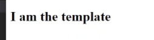

VUE se puede usar de dos maneras. Creando una aplicación de una página web, o crear simplemente widgets que controlen una página web. 
Empezaremos con un widget y lo meteremos en un html, ya que requiere un setup mínimo, y solo tenemos que añadir la librería de vue cdn que copiamos de la documentación de VUE.

```html
<script src="https://unpkg.com/vue@3/dist/vue.global.js"></script>
```

Ahora podemos usar VUE en esta página.
Y vamos a crear otro archivo para poner el js llamada App.js

```html
<!DOCTYPE html>
<html lang="en">
<head>
    <meta charset="UTF-8">
    <meta name="viewport" content="width=device-width, initial-scale=1.0">
    <title>Document</title>
    <script src="https://unpkg.com/vue@3/dist/vue.global.js"></script>
</head>
<body>
    <!--Archivo de js-->
     <script src="app.js"></script>
</body>
</html>
```

Podemos decidir si VUE controla toda la página o solo cierta parte. En este caso, controlará solo una parte.
Priemro cereamos la app vue. Cuando importamos la librería de VUE, tenemos acceso a algo llamado objeto VUE. Para crear la app, usamos un método llamado createApp():

```js
const app = Vue.createApp()
```

Pero cómo le decimos qué aprte queremos que controle? Pues ahora tenemos acceso a un método llamado mount, y ese método le dice en qué parte del DOM montar la aplicación.
Por ejemplo, podemos decirle que lo haga en cierto elemento del DOM que tenga como id app. Para ello, en el html también creamos este div con id app.

## App.vue
```js
app.mount('#app')
```

### Todo lo que pongamos dentro del div es lo que controlará VUE.
Esto quiere decir que cualquier código dinámico o interactivo de los elementos que estén dentro de ese div, todo eso estará controlado por nuestra App vue. Es decir, podemos reaccionar a eventos, cambiar el contenido de los elementos, etc.
## index.html

```html
<div id="app"></div>
```

Psts hacer esto, le pasamos un objeto al método de createAApp. Este objeto representa un root componente en vue, que será el que controla la sección #app de la página. Dentro podemos poner datos, funciones etc apra reaccionar a eventos. También podemos especificar dentro la plantilla que queremos renderizar. Por ejemplo:

### App.js

```js
const app = Vue.createApp({
    template: '<h2>I am the template</h2>'
})

app.mount('#app')
```
Ahora va a inyectar esta plantilla en el div, y en el navegador aparecerá:



Pero puede ser muy desorganizado tener la plantilla si tiene muchas líneas allí, por lo que lo que se hace es meter directamente la plantilla en el div #app. Básicamente, html normal. Pero podemos sacar data dinámicamente mediante vue.

### Data and Templates

Si tenemos un valor que tenemos que varía, por ejemplo el título de un libro, podemos poner un tipo de variable de título. Lo que hacemos es crear dentreo del componente un método data.
Tenemos que crear una función y devolver un objeto de la siguiente manera:

```js
const app = Vue.createApp({

    data(){
        return{}
    },
```

Las propiedades que hagamos dentro de este objeto serán entonces accesibles a nuestra plantilla:

```js
const app = Vue.createApp({

    data(){
        return{
            title: 'The Last Empire',
        }
    },
```
Por ejemplo, ahora en el div de #app podemos acceder mediante una variable a este dato, así:

```html
<div id="app">
    <p>{{ title }}</p>
</div>
```
Veremos un párrafo en el navegador que pone "The Last Empire".
Ahora esto e sun valor dinámico cambiable.

Podemos poner tantas propiedades en el objecto como queramos.

```js
const app = Vue.createApp({

    data(){
        return{
            title: 'The Last Empire',
            author: 'Brandon Sanderson',
            age: 49
        }
    },
```

```html
<div id="app">
    <p>{{ title }} - {{ author }} - {{ age }}</p>
</div>
```

No importa qué tipo de data usemos en este objeto. Podemos usar números, obnjetos, strings, arrays...
La única limitación es el scope que tenemos para estos datos, que se encuentra dentro del div #app donde se monta la aplicación.

### Click Events

Cuando queremos que algo dispare código, como cambiar un valor de las propiedades, es decir, reaccionar a ciertos eventos, utilizamos la directiva `v-on` en algún elemento. (Hay muchos tipos de directivas). Para decir a qué reacciona, ponemos :click si queremos que sea al hacer click. Por ejemplo:

Digamos que queremos por ejemplo incrementar la edad por 1 al dar click. Podemos poner el código js directamente en la plantilla, o hacerlo desde App.js.

#### Desde la plantilal:

No necesitamos usar corchetes dentro de las directivas para escribir js, solo cuando queremos sacar un valor al navegador se usan.

```html
<button v-on:click="age++">Increase Age</button>
<button v-on:click="age--">Decrease Age</button>
```

Un shorcut de v-on:click es `@click` !

 Por ejemplo, hagamos que al hacer click en este div, el título cambia a 'Something Else':

```html
<div @click="title='Something Else'">Change Title</div>
```
#### Desde el componente:

Tenemos que crear otra propiedad en el objeto CreateApp llamada methods.
Cualquioer función o método que queramos usar lo colocamos aquí.

```js
const app = Vue.createApp({

    data(){
        return{
            title: 'The Last Empire',
            author: 'Brandon Sanderson',
            age: 49
        }
    },
    methods:{
        changeTitle(){
            console.log('You clicked me')
            this.title = 'Words of Radience'
            }

    }

})
```

Para llamar a este método de cambiar título desde la plantilla, solo tenemos que llamar a la función desde allí:

```html
<div @click="changeTitle">Change Title</div>
```

También podemos pasar el valor mediante string a la función de esta manera:

```html
<div @click="changeTitle('Oathbringer')">Change Title</div>
```
Tenemos que pasarle el parámetro title a la función para que la acepte, el cual podemos llamar como queramos:

```js
methods:{
        changeTitle(title){
            console.log('You clicked me')
            //this.title = 'Words of Radience'
            this.title = title
            }

    }
```

## Conditional Rendering

A veces queremos mostrar contenido si se cumplen ciertas condiciones. 
Para esto tenemos qu eusar una directiva de vue llamada `v-if`
Por ejemplo, digamos que queremos mostrar el título del libros según una condición.
Vue evalua lo que está dentro de las comillas v-id="". Si lo evalua como cierto, entonces mostrará lo que está dentro del div, si no, no lo muestra.

Para la condición, vamos a poner una nuesva propiedad llamada `ShowBooks`, poniendo por ejemplo true o false. Así, le pasamos esta propiedad al v-if para mostrar o no el párrafo del div.

### index.html

```html
<div id="app">
    <div v-if="showBooks">
        <p>{{ title }} - {{ author }} - {{ age }}</p>
    </div>
</div>
```


```js
const app = Vue.createApp({

    data(){
        return{
            showBooks: true,
            title: 'The Last Empire',
            author: 'Brandon Sanderson',
            age: 49
        }
    },
    methods:{
    }

})
```

Pero y si queremos hacer un toggle para mostrar y no mostrar alternadamente la información?
Por ejemplo, al hacer click a un botón, el valor de showBooks cambia de true a false y viceversa.


Creamos un elemento botón con un span dentro, y llamamos a un método que crearemos en el App.js llamado toggleShowBooks:

### index.html

```html
<div id="app">
    <div v-if="showBooks">
        <p>{{ title }} - {{ author }} - {{ age }}</p>
    </div>

    <button @click="tottleShowBooks">
        <span>Hide Books</span>
    </button>
</div>
```

En este método revertimos el valor de ShowBooks al igualarlo con lo contrario de loq ue sea.

```js
    methods:{
        tottleShowBooks(){
            this.showBooks = !this.showBooks
    }

})
```

Pero para que no muestre siempre el mismo mensaje de ocultar libros, vamos a poner la condición de poner hide cuando ShowBooks es True, y show cuando no los muestre.
```html
<button @click="toggleShowBooks">
        <span v-if="showBooks">Hide Books</span>
        <span v-if="!showBooks">Show Books</span>
</button>
```

Pero también en lugar de tener dos v-if, podemos utilizar v-else y hará lo mismo:

```html
<button @click="toggleShowBooks">
        <span v-if="showBooks">Hide Books</span>
        <span v-else>Show Books</span>
</button>
```

### Directova v-show

Funciona muy parecido a lo que teníamos. Si la propiedad es cierta, en este caso, showBooks, va a mostrar el mensaje, y si no, no.
La diferencia es que con v-if, vue no va a mostrar en el DOM el elemento si es falso y lo inyecta solo cuando es true, mientras que con v-show, utiliza solo css para poner display: none si no es cierto, y display:block cuando sí es cierto. Pero el div sigue estando en el html.

```html
<div v-show="showBooks">Currently showing books</div>
```