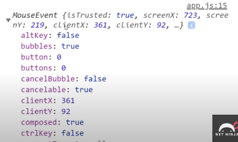
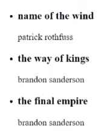
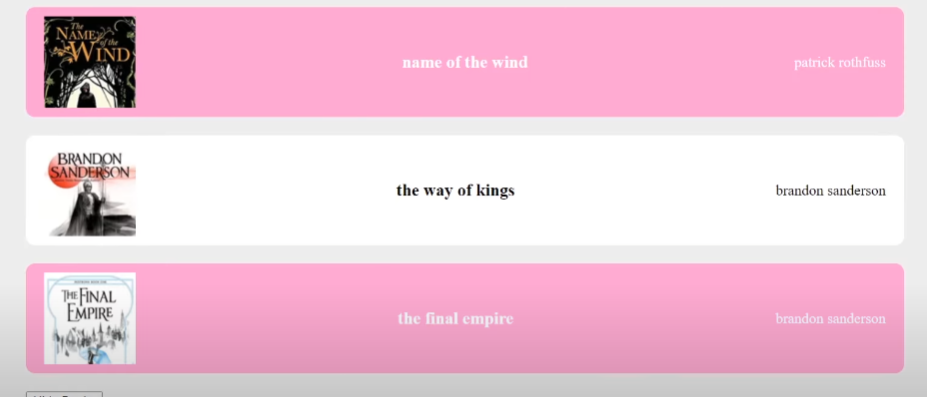

## Mouse Events y Event Objects

Vamos a colocar un evento distinto para cada div de clase box.
podemos utilizar @ en lugar de v-on para abreviar.

```html
<!--Pasar el ratón por encima, al entrar-->
<div class="box" @mouseover="handleEvent">Mouseover</div>
<!--Al salir el ratón del elemento-->
<div class="box" @mouseleave="handleEvent">Mouseleave</div>
<!--Al hacer doble click-->
<div class="box" @dbclick="handleEvent">Double Click</div>
```
Activarán el método handleEvent que vamos a crear en methods:{} en la App.js. Por ejemplo,

```js
methods: {
    handleEvent() {
        console.log('event')
        }
    }
```

Cada vez que usamos un event listener, tenemos automáticamente acceso a un objeto. Este puede ser incluido como un primer parámetro. Por ejemplo:

```js
methods: {
    handleEvent(e) {
        console.log(e, e.type)
        }
    }
```

Vemos que tiene mucha información sobre el evento.



También podemos mirar el tipo poniendo como parámetro nombre del objeto y el type. Nos dirá por ejempolo que es un "mouseover" o un "dbclick".

Pero y si queremos pasar un parámetro personalziado?
Pues si le pasamos un argumento, entonces no nos dará el objeto como primer parámetro, pero podemos especificar que también queremos el objeto explícitamente de esta manera, y luego, nuestros argumentos después:

`$event`

```html
<div class="box" @mouseover($event, 5)="handleEvent">Mouseover</div>
```

Se comprueba que haya datos porque no siempre debe haberlos.

```js
methods: {
    handleEvent(e, data) {
        console.log(e, e.type)
        if (data) {
            console.log(data)
        }
        }
    }
```

Ahora probamos otr
o tipo de evento. Mousemove.

```html
<div class="box" @mousemove="handleMousemove">Mouse Move</div>
```
Lo que queremos hacer ahora es actualizar dos propiedades. Las cuales vamos a crear, x e y en los data, que empezará en 0, pero que vamos a modificar cuando dispare el método handleEvent y 

```js
data() {
    return {
        x:0,
        y:0
    }
methods: {
    handleMouseEvent(e) {
    this.x = e.offsetX
    this.y = e.offsetY
         
        }
    }
```
El offset será la posisición x o y del ratón dentro de ese div.

Y en la plantilla:

```html
<div class="box" @mousemove="handleMouseEvent">position - {{x}} {{y}}</div>
```
Ahora cuando nos movemos dentro de la caja, disparará el evento, y en ese punto tomamos el valor del objeto en la función, se actualizan los valores de x e y, y serán reflejados en la plantilla.


## Outputting Lists

`v-for` es una directiva que usamos para recorrer una lista de datos y sacar en una plantilla cada uno de los elementos de esa lista.

Vamos a hacer eso con libros.

Supongamos que tenemos una propiedad libros, que sea un array que cntenga libros, y que cada libro sea un objeto que contenga una propiedad título y autor.

```js
const app = Vue.createApp({
    data(){
        return{
            showBooks: true,
            books: [
                {title: 'name of the wind', author: 'patrick rothfuss'},
                {title: 'the way of kings', author: 'brandon sanderson'},
                {title: 'the final empire', author: 'brandon sanderson'},
            ]
        }
    }
```

En la plantilla entonces podríamos sacar los datos de esta manera:

```html
<div id="app">
    <div v-if="showBooks">
        <p>{{ books[0].title }} - {{ books[0].author }}</p>
        <p>{{ books[1].title }} - {{ books[1].author }}</p>
        <p>{{ books[2].title }} - {{ books[2].author }}</p>
    </div>
</div>
```

Y funcionaría, pero eso es poco práctico, ya que si la lista fuera grande, hacer esto para cada libro es molesto, y quizá ni siquiera sabes cuántos elementos hay, por lo que no podrías hacerlo de esta manera.
En vez de eso, usamos v-for.
Podemos llamar como queramos al elemento de la lista como "book" de book in books, o item, o como queramos, pero el segundo se corresponde con la propiedad que tenemos en data el array de libros, que llamamos books, y queda más coherente ponerle el nombre en singular.
Podemos sacar las distintas propiedades de cada libro

```html
<div id="app">
    <div v-if="showBooks">
        <ul>
            <li v-for="book in books">
                <h3>{{ book.title }}</h3> 
                <p>{{ book.author }}</p>
            </li>
        </ul>
    </div>
</div>
```



## Attribute Binding

Es cuando enlazamos valores dinámicos a atributos html. Por ejemplo, un link href, si queremos que el valor de ese link sea dinámico.
Para eso crearíamos una propiedad url en data:

```js
const app = Vue.createApp({
    data(){
        return{
            url: 'https://www.loquesea.com',
            showBooks: true,
//etc
```
Pero ahora en el html, tenemos que hacer lo que se llama enlazar atributos para que funcione.
v-bind:atributo hace que lo que sea que esté dentro sea contenido dinámico, y dentro podemos acceder a las propiedades de nuestro componente app, incluida la url que tenemos.

```html
<a v-bind:href="url">Best Website</a>
```
Se utiliza esto bastante, tanto que también se puede abreviar de esta manera:

```html
<a :href="url">Best Website</a>
```

Podemos hacer esto con muchos otros atributos. Vamos por ejemplo a asignarle una imagen a cada libro.
Vamos a tener una carpeta assets con imágenes, llamadas 1.jpg, 2.jpg, 3.jpg.

Vamos a aladir una propiedad nueva a cada libro, img, que va a contener la ruta de cada imagen.

```js
            books: [
                {title: 'name of the wind', author: 'patrick rothfuss', img: 'assets/1.jpg'},
                {title: 'the way of kings', author: 'brandon sanderson', img: 'assets/2.jpg'},
                {title: 'the final empire', author: 'brandon sanderson', img: 'assets/3.jpg'},
 
```

Ahora ya podemos enlazar cada libro con la ruta de su imagen, y el texto alternativo, es el nombre del libro.
```html
<div id="app">
    <div v-if="showBooks">
        <ul>
            <li v-for="book in books">

                

                <h3>{{ book.title }}</h3> 
                <p>{{ book.author }}</p>
            </li>
        </ul>
    </div>
</div>
```

### Clases dinámicas

Significa darle a un elemento una clase dependiendo de cierta condición. Por ejemplo, podríamos ponerle una clase a cada libro en este caso, según el valor de algo de cada libro.
Así que para probarlo, vamos a añadirle otra propiedad nueva a los libros llamada isFav, que será un booleano que nos dirá si el libro es favorito o no.

```js
books: [
                {title: 'name of the wind', author: 'patrick rothfuss', img: 'assets/1.webp', isFav: true},
                {title: 'the way of kings', author: 'brandon sanderson', img: 'assets/2.jpg', isFav: false},
                {title: 'the final empire', author: 'brandon sanderson', img: 'assets/3.jpg', isFav: true},
            ]
```

Lo que podemos hacer es evaluar esa propiedad cada vez que recorremos los libros, y aplicar le una clase si es true, y otra si es false. Así podemos darle unos estilos un poco distintos si es true.
Para ello podemos enlazar atributos así:

```html
<div id="app">
    <div v-if="showBooks">
        <ul>
            <!-- Pasamos un objeto a la propiedad :class. Este objeto contiene pares clave-valor (key-value pairs). 
            Por cada par clave-valor, se evalúa la clave (key) como el nombre de una clase CSS condicional.

            Por ejemplo:
            - La clave "fav" representa el nombre de la clase CSS que queremos aplicar.
            - El valor asociado a esta clave será una expresión que evalúa si la clase debe aplicarse o no.

            En este caso:
            - La clase "fav" se aplicará al elemento `<li>` si el valor `book.isFav` es verdadero (true).
            - Si el valor de `book.isFav` es falso (false), la clase "fav" no se aplicará.

            Esto significa que el elemento `<li>` tendrá la clase CSS "fav" solo cuando `book.isFav` sea verdadero.
            -->
                <li v-for="book in books" :class="{ fav: book.isFav }"></li>

                
                <h3>{{ book.title }}</h3> 
                <p>{{ book.author }}</p>
            </li>
        </ul>
    </div>
</div>
```

Podemos estilizar esto un poco para que se vea mejor. Por ejemplo, aplizar un color de fondo distinto a los libros que tengan la clase fav.



## Toggling Favs

El objetivo es que, al hacer clic en un elemento <li>, se cambie el estado de la propiedad isFav del libro correspondiente, alternando entre true y false. Esto sirve para marcar o desmarcar un libro como favorito.

`@click="toggleFav(book)"`: Vincula un evento click al elemento li. Cuando se hace clic en el li, se llama a la función toggleFav pasando como argumento el objeto book del libro correspondiente.

Se le pasa el libro porque necesitamos identificar exactamente cuál libro fue clicado para actualizar su estado. Si no pasamos el objeto book, la función no sabría a cuál libro debe cambiarle el estado de isFav.

```html
<li v-for="book in books" :class="{ fav: book.isFav }" @click="toggleFav(book)"></li>
```

```js
toggleFav(book) {
    book.isFav = !book.isFav
}
```

La función recibe como argumento el objeto book que fue pasado desde el @click y cambia el valor de isFav del libro.


### Computed Properties (propiedades calculadas)

Es una manera de definir una propiedad de dato dentro de nuestro componente que depende de otro dato que tenemos en ese componente. Por ejemplo, quizá queramos crear 
una lista de libros filtrados, pero esta depende de la lista de libros que tenemos ya en los datos. Si estos datos cambian, entonces también cambiaría nuestra lista de libros filtrados. Podría ser por ejemplo una lista de libros que filtren solo los que son favoritos. Así que cómo haríamos esta propiedad calculada?

Pues primero, tenemos que crear dentro del objeto una propiedad computed: {}, como tenemos methods: {} en este objeto, también tenemos computed: {}.
Dentro de este, creamos una función. Esta función devolverá un valor, y podremos acceder a ese valor mediante la plantilla.

Para ello referenciamos los libros usando this para referenciar al componente y books para usar la propiedad de libros que queramos.
Usamos la propiedad de js llamada filter. Este dispara una función callback para cada elemento dentro del array de libros. Y si devuelve true, vamos a mantener ese elemento en 
el array. Si es false, entonces no lo incluye en el array.
Cada vez que iteramos, tenemos acceso al libro por el que estamos iterando, así que podemos pasarlo al filtrado Queremos que devuelva true cuando sea favorito, y esto será cierto o falso según vamos recorriendo los libros.

```js
computed: {
    filteredBooks() {
        return this.books.filter((this) => book.isFav)
    }
}
```

Así que en la plantilla ven lugar de recorrer books, vamos a recorrer filteredbooks, y solo aparecerán los que son fav.

```html
  <li v-for="book in filteredBooks" :class="{ fav: book.isFav }"></li>
```

Y ahora si le damos click, pasa a no ser favorito y por ende, desaparecerá. Si refrescamos, estarán de nuevo.

