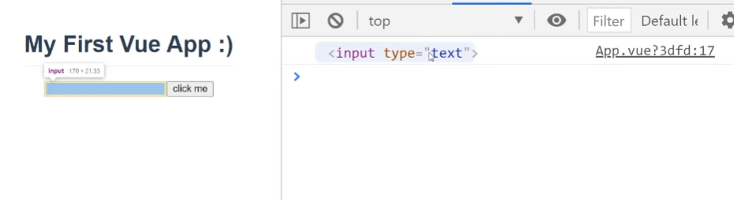
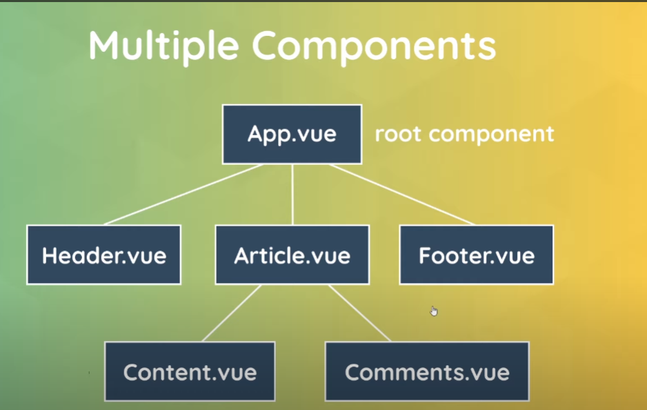

Hasta ahora, hemos creado únicamente widgets con Vue. Sin embargo, es posible desarrollar páginas web completas con múltiples componentes, rutas y secciones, todo controlado por Vue.

Para lograr esto, debemos configurar Vue de una manera diferente a la que hemos usado hasta ahora. En lugar de trabajar solo con el CDN, utilizaremos el CLI (Command Line Interface) de Vue.

El enfoque con Vue CLI permite crear aplicaciones de una sola página (SPA, por sus siglas en inglés). En este modelo, el servidor envía un único archivo HTML al navegador, y a partir de ahí, Vue toma el control total de la aplicación, inyectando dinámicamente los componentes que forman parte de la página.

Las ventajas de usar el Vue CLI incluyen:

- La posibilidad de utilizar características modernas de JavaScript que no son compatibles de forma nativa con todos los navegadores.
- Contar con un servidor de desarrollo con recarga automática para previsualizar los cambios en tiempo real.
- Optimización del código para producción, lo que reduce su tamaño y mejora el rendimiento de la aplicación.

### Usando VUE CLI

Primero tenemos que descargar Node.js. Para esto simplemente hay que buscar la página y descargarlo. Le damos clic y lo instalamos.

Si escribimos en la terminal `node -v`, nos debe aparecer la versión instalada.

Ahora instalamos otro paquete, Vue, usando npm, proporcionado por Node.

```bash
npm install -g @vue/cli
```

Ahora que está instalado, podemos utilizarlo en la terminal para generar proyectos. Primero tenemos que navegar hasta el directorio en el que queremos crear el proyecto usando `cd` para movernos por los directorios.

A continuación, escribimos:

```bash
vue create nombre-proyecto
```

Va a preguntar distintas cosas. Primero, lo mejor es seleccionar `Manually select features` para elegir según el proyecto lo que queramos usar.  
Para este caso, basta con marcar `Choose Vue version` y `Babel`. Y elegimos luego la versión `3.x`. A la siguiente pregunta: `In dedicated config file`, y por último, `N` para no mantener guardada esta configuración para todos los proyectos.

Creará el proyecto.

Ahora lo primero que tenemos que hacer es entrar al directorio del proyecto creado: `cd nombre-proyecto`.  
Para trabajar con VSCode, ponemos `code .`, y se nos abrirá ese directorio en Visual Studio Code.

Aquí habrá varias carpetas y archivos.

### New Project Walkthrough
- `node-modules`: donde se encuentran las dependencias o librerías de este proyecto.
- `public`: contiene el index.html, que se manda al navegador inicialmente. Es la single page para la single page application. Allí hay un div con la id de `app`, y será donde se montarán los componentes de forma dinámica.
- `src`: contiene todos los componentes, los assets, el código principal, CSS... y `main.js`, que es el archivo que inicia nuestra aplicación utilizando el método `createApp`. Aquí también van las importaciones que necesitemos. Por ejemplo, importa App con los métodos y datos de otro componente en lugar de hacerlo directamente aquí.
  - `App.vue`: contiene tres partes: template, script y styles. Cada componente de Vue tiene estas tres partes. Pero este es el componente raíz que estamos montando en main.js.

El resto de archivos no tenemos que tocarlos, excepto `package.json`, que lo referenciaremos ya que contiene nuestras dependencias y scripts para construir nuestra aplicación.

Por ejemplo, vamos a ejecutar el script serve para previsualizar nuestra aplicación.  
Para ello, escribimos en la terminal `npm run serve`, y nos dará un enlace para abrir en el navegador usando Ctrl + clic.

### Archivos y plantillas de Vue

Cada archivo `.vue` representa un componente. Para ver bien la sintaxis de Vue en VSCode, hay que instalar la extensión `Vetur`, porque si no, se verá mal el código.

Las tres partes de un componente:
- `template`: es donde se define la estructura de la página.
- `script`: es donde se exporta el objeto componente. También va la lógica, pudiendo añadir datos, métodos... como vimos antes en un widget Vue.
- `style`: es donde se define el estilo del componente.

El script y los estilos son opcionales, pero debe tener al menos una plantilla.

```vue
<template>
  <h2>{{ title }}</h2>
</template>

<script>
export default {
  name: 'App',
  data() {
    return {
      title: 'My first VUE App :)'
    }
  }
}
</script>

<style>
#app, #modals {
  font-family: Avenir, Helvetica, Arial, sans-serif;
  -webkit-font-smoothing: antialiased;
  -moz-osx-font-smoothing: grayscale;
  text-align: center;
  color: #2c3e50;
  margin-top: 60px;
}
</style>
```

La manera en la que sacamos los datos es exactamente igual que como hicimos antes. Podemos hacer que solo se apliquen a un componente añadiendo a la etiqueta style `scoped`, pero lo veremos más adelante.

#### Nota

En caso de que descarguemos un proyecto desde GitHub, por ejemplo, habrá que instalar las dependencias escribiendo en la terminal `npm install`, ya que `node-modules` suele estar en `.gitignore` y no se subirá a GitHub.

### Referencias en Plantillas

Se usan en Vue en lugar de utilizar jQuery. Nos permiten guardar una referencia de un elemento del DOM dentro de una variable. Luego podemos utilizar JavaScript normalmente para hacer cosas como cambiar las clases, contenido, estilos, etc. ¿Cómo se usan? Vamos a ver un ejemplo:

```vue
<template>
  <h2>{{ title }}</h2>
  <input type="text" ref="name">
  <button @click="handleClick">Click me</button>
</template>

<script>
export default {
  name: 'App',
  data() {
    return {
      title: 'My first VUE App :)'
    }
  },
  methods: {
    handleClick() {
      console.log(this.$refs.name)
    }
  }
}
</script>
```

Aquí simplemente intentamos obtener el control de este input. La manera de hacerlo es utilizando `ref`.  
Para ello usamos `this`, como antes cuando queremos acceder a cualquier dato, y `$refs` para acceder a las referencias. Puedo acceder en ese objeto de referencia a cualquier `ref` que hayamos nombrado en este componente. En este caso, `name`. `this.$refs.name`.



Vemos que ha capturado el elemento que queremos.

Ahora podemos hacer cosas normales de JavaScript con este elemento. Por ejemplo, utilizar `classList` para añadir la clase `active` a este elemento. O, por ejemplo, hacer un focus para enfocarlo:

```vue
methods: {
  handleClick() {
    console.log(this.$refs.name)
    this.$refs.name.classList.add('active')
    this.$refs.name.focus()
  }
}
```

### Múltiples Componentes

Podemos hacer toda nuestra página web en un único componente, pero esto podría ser un desastre difícil de leer y caótico. Así que esto no es buena idea.  
Es mejor separar en distintos componentes Vue. Por ejemplo, podemos tener un componente para el Navbar, otro para el Header, un Sidebar, un Article, un Footer. Esto hace el componente mucho más comprensible y fácil de mantener. Y hace el proyecto más modular y reutilizable, ya que podremos utilizar el componente en distintas partes de la página web.

App.vue siempre será el componente raíz. Este es el componente que se encuentra en la parte superior de la estructura de la aplicación y se monta inicialmente en el DOM. Todos los componentes estarán anidados dentro de este componente.

Un ejemplo de cómo podría verse la estructura de árbol de una aplicación Vue sería esta:



Cuando anidamos componentes dentro de otros, llamamos a estos componentes secundarios. Y al componente que los contiene, el componente principal.

Cuando creamos el proyecto ya se nos creó la carpeta `components`, y es aquí donde irán los componentes, por convención de estructura. Borramos el `HelloWorld.vue` que viene de ejemplo, y creamos otro componente. Por ejemplo, `Modal.vue`. Es recomendable que la primera letra del componente sea en mayúscula para evitar conflictos.

```vue
<template>
  <div class="backdrop">
    <div class="modal">
      <p>Modal content</p>
    </div>
  </div>
</template>

<style>
.modal {
  width: 400px;
  padding: 20px;
  margin: 200px auto;
  background: rgb(207, 191, 191);
  border-radius: 10px;
}
.backdrop {
  top: 0;
  position: fixed;
  background: rgba(0, 0, 0, 0.5);
  width: 100%;
  height: 100%;
}
</style>
```

Ahora queremos usar este componente dentro de nuestro componente `App.vue`.  
Para hacer esto, primero tenemos que importar este componente Modal en el script de esta manera.  
Y para decirle que queremos usarlo dentro de este componente, lo hacemos dentro del objeto `export default`.  
Aquí añadimos el objeto `components: {}`.

<!-- App.vue -->
```vue
<script>
import Modal from './components/Modal.vue'

export default {
  name: 'App',
  components: { Modal }
}
</script>
```

Y para usarlo en la plantilla, simplemente basta con poner el nombre del componente, así como si fuera una etiqueta HTML más:

```html
<template>
  <Modal />
</template>
```

Para que funcione, tenemos que primero importar el componente y registrarlo en `components` como hemos hecho.