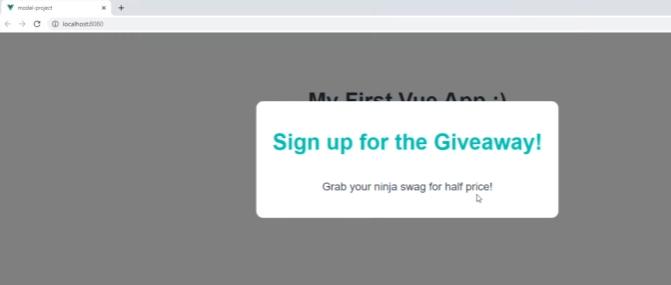
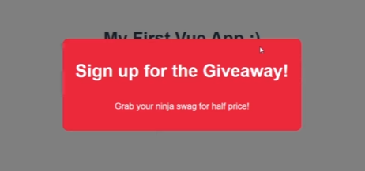

### Estilos

Como habíamos comentado, los estilos del componente se aplcian a todo. Exepto si colocamos en la etiqueta de estilos `scoped`:

```html
<style scoped>
</style>
```

Lo malo de esto es que el rendimiento de vue puede ser un poco peor si tenemos muchísimos estilos así que añadir de cada componente.
Otra opción es hacer el selector más específico para ese componente con una clase o tipo de atributo, por ejemplo añadiendo `nav` y el estilo que sea para que solo aplique allí.
Lo más común es tener en assets un estilo global, llamado por ejemplo global.css.
Este fichero habría que importarlo en main.js:

```js
import "./assets/global.css"
```

### Props

Podemos pasar props de un componente padre a un componente hijo.
Esto hace a los componentes más reutilizables.  
En este caso, significaría utilizar el componente Modal en varias partes de la página para cosas distintas,
porque no estaríamos hardcodeando los mensajes de dentro de este.
Pasaremos los datos de este como una prop. Y cada vez que uses el modelo pasamos distinto contenidoc como prop de su componente padre.
También permite poder pasarle los datos a varios componentes si estos utilizan los mismos datos. Esto se llama tener una única fuente de verdad.Si no, habría que repetir los datos y sería difícil mantener la consistencia.


¿Cómo hacerlo?

Pues hay que ir al componente y pasarle un atributo, ese atributo es la prop, que podemos llamar como queramos.

Por ejemplo:
<!--App.vue-->
```html
<template>
  <Modal header="Sign up for the Giveaway!" text="Grab your free copy right now!" />
</template>
```

Si ahora quiero utilizar estos datos en el componente Modal, tenemos que decirle a VUE que este componente debe aceptar cierta prop. Esto se hace dentro de la etiqueta script del componente:

<!--Modal.vue-->
```html
<script>
export default {
    props: ['header', 'text']
}
</script>
```

Ahora si quiero utilizar el header, en el template solo hay que escribirlo tal cual.

<!--Modal.vue-->

```html
<template>
  <div class="backdrop">
    <div class="modal">
    <h2>{{ header }}</h2>
      <p>{{ text }}</p>
    </div>
  </div>
</template>
```


Pero para que se vea mejor, y sea más fácil de leer y actualizar podemos pasar los datos desde data y enlazarlo como hemos visto. Es decir:

<!--App.vue-->
```js
<template>
  <Modal :header="header" :text="text" />
</template>

<script>
export default {
  name: 'App',
  components: { Modal },
  data() {
    return {
        header: 'Sign up for the Giveaway!',
        text: 'Grab your free copy right now!'
  }
}
</script>
```

Vamos a probar a añadir una tercera prop llamada theme. Y basado en el valor de ese tema, dentro del modal podemos añadir una clase condicional para estilizarlo diferente.

```js
<template>
  <Modal :header="header" :text="text" theme="sale" />
</template>
```
Lo registramos en el componente modal:

```html
<script>
export default {
    props: ['header', 'text', 'theme']
}
</script>
```

Si el thema es sale, podemos darle al modal la clase sale y ponerle un estilo.

<!--Modal.vue-->
```html
<template>
  <div class="backdrop">
    <!--Si es el tema igual a sale, entonces se aplica la clase sale-->
    <div class="modal" :class="{sale: theme === 'sale'}">
    <h2>{{ header }}</h2>
      <p>{{ text }}</p>
    </div>
  </div>
</template>
```

Todo lo que tenemos que hacer ahora es ponerle estilos a esa clase.

```css
.modal.sale{
    background-color: crimson;
}
.modal.sale h1{
    color: white;
}
```


### Emitir Emitir Personalizados

Ahora, tenemos que hacer que el modal no se muestre por defecto siempre o mostrarse por default.

Así que vamos a crear una propiedad nueva en nuestros datos en App.vue.
Esta se va a llamar `showModal`, y será un boleano, para dinámicamente mostrar el modal.

```html
<script>
export default {
  name: 'App',
  components: { Modal },
  data() {
    return {
        header: 'Sign up for the Giveaway!',
        text: 'Grab your free copy right now!'
        showModal: false
  }
}
</script>
```

Vamos a hacer que se muestre con un `v-if` para que solo cuando sea true se muestre, cuando se de click a un botón:
Vamos a meter en un div el modal:

<!--App.vue-->
```html
<template>
  <div v-if="showModal">
    <Modal :header="header" :text="text" theme="sale" />
</template>
<button @click="toggleModal">Mostrar Modal</button>
  </div>
</template>
```

Para eso tenemos que crear la función debajo de los datos en App.vue de toggleModal que revierta el valor del modal:

```JS
methods: {
    toggleModal() {
        this.showModal = !this.showModal
    }
}
```

Ahora necesitamos una manera de cerrar el modal. Queremos cerrar el modal cuando hacemos click fuera de él, es decir el div que está por fuera del modal que llamamos backdrop.

Antes que nada queremos añadir un evento de hacer click al div:

<!--Modal.vue-->
```html
<template>
  <div class="backdrop" @click="closeModal">
    <div class="modal" :class="{sale: theme === 'sale'}">
    <h2>{{ header }}</h2>
      <p>{{ text }}</p>
    </div>
  </div>
</template>
```

Ahora tenemos que crear el método dentro de este componente.
Pero ahora necesitamos una manera de hacerle saber al modal que queremos cerrarlo ejecutando toggleModal.
Pues podemos hacer un evento personalizado. Este puede ser lanzado por un componente y ser escuchado por el componente padre.
Priemro necesitamos una manera de emitir este evento, que se hace con `this.$emit()` esto es una función y el nombre dentro de esta será el evento que queremos ejecutar.

```html
<script>
export default {
    props: ['header', 'text', 'theme']
    methods: {
       this.$emit('close')

    }
}
</script>
```

Así que ahora como cuando usamos @click para lanzar un evento, usamos @close, y cuando se lance, cualquier función que escribimos allí se ejecuta. Así que ahora queremos lanzar la función de `toggleModal` para esconderlo.

<!--Modal.vue-->
```html
<template>
  <div v-if="showModal">
    <Modal :header="header" :text="text" theme="sale" @close="" />
</template>
<button @click="toggleModal">Mostrar Modal</button>
  </div>
</template>
```
### Click Event Modifiers

aA VECES cuando usamos eventos queremos modificar cómo y cuándom reaccionar al evento. Por ejemplo si queremos que sea solo cuando el suusarioi está pulsando una tecla como Alt. 
Ene sete caso queremos restringir el evento click para que solo se actbe si pulsamos el emenento de fondo, y no cuando pulsamos el modal.
Para esto podemos usar modifivador de eventos de click. Estos modifican cómo el ebento click es registrado cuando reaccionamos a ellos.

Así que la manera en la que modificamos un evento es poniendo un punto y el nombre del modificador. Hay muchos de ellos que aparecen en vscode. Por ejemplo `@click.right` que significa solo reaccionar cuando se trate de un click derecho, y alt o shift.

<!--Modal.vue-->
```html
<template>
  <div v-if="showModal">
    <Modal :header="header" :text="text" theme="sale" @close="" />
</template>
<button @click.alt="toggleModal">Mostrar Modal (alt)</button>
  </div>
</template>
```

Y para evitar que el modal se cierre cuando se haga click en el fondo, podemos usar `@click.self` en el div con clase backdrop:

<!--Modal.vue-->
```html
<template>
  <div class="backdrop" @click.self="closeModal">
    <div class="modal" :class="{sale: theme === 'sale'}">
    <h2>{{ header }}</h2>
      <p>{{ text }}</p>
    </div>
  </div>
</template>
```

Y ahora solo se cerrará cuando se haga click fuera del modal.


### Slots

A veces queremos pasar info más compleja en cuando a conenido, a un componente. Pues para eso sirven los slots, son muy útiles para pasarle plantillas personalizadas a los componentes.
No son un sustituto de props, sino están especialmente diseñados para pasar plantillas, sin embargo usaríamos una prop para pasar datos como un simple string o array. Así que son muy distintos a los props.

Así que ahora vamos a eliminar los props header y text de contenido de nuestro componente modal, y vamos a pasarle un slot en su lugar.
Ahora queremos pasarle contenido como slot a este modal:

Para eso tenemos que abrir y cerrar la etiqueta del componente modal,
y dentro de este, pasar una plantilla como si tuviéramos un contenido html dentro. Este contenido que pasemos dentro es conocido como slot. Y se pasará como slot al componente, para poder usarlo.


<!--App.vue-->
```html
<template>
  <div v-if="showModal">
    <Modal theme="sale">
        <h2>Giveaway!</h2>
        <p>Grab your free gift now!</p>
    </Modal>
</template>
<button @click="toggleModal">Mostrar Modal</button>
  </div>
</template>
```

Y ahora, para poder usar este contenido, vamos a Modal.vue,
y tenemos que escribir slot.

```html
<template>
  <div class="backdrop" @click.self="closeModal">
    <div class="modal" :class="{sale: theme === 'sale'}">

        <slot></slot>

    </div>
  </div>
</template>
```
Ahora lo que pasará es que el contenido que pasemos en App.vue, se mostrará dentro del modal en la parte en la que está la etiqueta slot.

Pero así como podemos pasar slots así, también podemos pasarle Name slots.
Digamos que quiero pasarle un contenido peo este tiene que tener una estructura muy concreta. 
Por ejemplo, digamos que tenemos debajo de slots otro divs con links, y queremos que el contenido sean los links y meterlos dentro, podemos usar name slots.

<!--Modal.vue-->
```html
<template>
  <div class="backdrop" @click.self="closeModal">
    <div class="modal" :class="{sale: theme === 'sale'}">

        <slot></slot>
        <div class="actions">
            <!--Aquí es donde quisiéramos tener los links-->
        
        </div>

    </div>
  </div>
</template>
```

Creamos un name slot utilizando una etiqueta de plantilla. Esta puede ir donde queramos. 
Esta puede ir donde queramos. 
Creamos una plantilla, y luego tenemos que darle un nombre utilizando la directiva `v-slot`.

<!--App.vue-->
```html
<template>
  <div v-if="showModal">
    <Modal theme="sale">

        <template v-slot:links>
            <a href="#">Sign up Now</a>
            <a href="#">More Info</a>
        </template>

        <h2>Giveaway!</h2>
        <p>Grab your free gift now!</p>
    </Modal>
</template>
<button @click="toggleModal">Mostrar Modal</button>
  </div>
</template>
```

Este no va a mostrarse directamente donde pone slot como el resto.
¿Entonces cómo los mostramos?
Pues donde queramos que vaya el slot, añadimos una etiqueta slot y especificamos su nombre:

<!--Modal.vue-->
```html
<template>
  <div class="backdrop" @click.self="closeModal">
    <div class="modal" :class="{sale: theme === 'sale'}">

        <slot></slot>
        <div class="actions">
            <slot name="links"></slot>
        
        </div>

    </div>
  </div>
</template>
```


Además, volviendo a lo de antes, podemos pasarle contenido por defecto al slot:

<!--Modal.vue-->
```html
<template>
  <div class="backdrop" @click.self="closeModal">
    <div class="modal" :class="{sale: theme === 'sale'}">

        <slot>
            Este es el contenido por defecto!
        </slot>

        <div class="actions">
            <slot name="links"></slot>
        </div>
    </div>
  </div>
</template>
```

Pero este solo se mostrará si no pasamos un slot default. Pero cuando lo hacemos, no se muestra.

<!--App.vue
Así se vería el default content-->
```html
<template>
  <div v-if="showModal">
    <Modal theme="sale">

        <template v-slot:links>
            <a href="#">Sign up Now</a>
            <a href="#">More Info</a>
        </template>
    </Modal>
</template>
<button @click="toggleModal">Mostrar Modal</button>
  </div>
</template>
```
<!--App.vue
Así NO se vería el default content-->
```html
<template>
  <div v-if="showModal">
    <Modal theme="sale">

        <template v-slot:links>
            <a href="#">Sign up Now</a>
            <a href="#">More Info</a>
        </template>
        <!--Estas dos líneas serían el slot default-->
        <h2>Giveaway!</h2>
        <p>Grab your free gift now!</p>
    </Modal>
</template>
<button @click="toggleModal">Mostrar Modal</button>
  </div>
</template>
```

### Crear Otro Modal

- Crear un botón distinto para abrir un modal distinto.
- Usar el mismo componende Modal, pero pasarle una palntilla distinta (slot)
- Usar un método distinto (e.g toggleModalTwo) y data (e.g showModalTwo)


```html
<template>
  <div v-if="showModal">
    <Modal theme="sale" @close="toggleModal">

        <template v-slot:links>
            <a href="#">Sign up Now</a>
            <a href="#">More Info</a>
        </template>
        <!--Estas dos líneas serían el slot default-->
        <h2>Giveaway!</h2>
        <p>Grab your free gift now!</p>
    </Modal>

    <Modal @close="toggleModalTwo">

        <template v-slot:links>
            <h2>Join the community</h2>
            <p>Sign up to the newsletter</p>
        </template>
    </Modal>

<button @click.alt="toggleModal">Mostrar Modal</button>

<button @click="toggleModalTwo">Mostrar Modal2</button>
  </div>
</template>

<script>
export default {
  name: 'App',
  components: { Modal },
  data() {
    return {
        showModal: false,
        showModal2: false
    }
  },
  methods: {
    toggleModal() {
        this.showModal = !this.showModal
    },
     methods: {
    toggleModalTwo() {
        this.showModalTwo = !this.showModalTwo
    },
  }
}
</script>
```


### Usar Teleport

Sirve para teletransportar contenido que hayamos hecho en nuestra aplicación a un lugar del DOM distinto. Puede ser fuera del scope de la app incluso.
Por ejemplo, en index.html queremos colocarlo dentro de otro div no de app:

```html
<div id="app"></div>

<div class="modals"></div>
```

Tenemos que encontrar dónde está siendo reenderizado actualmente nuestro componente. Y eso es en App.vue. Para ello, solo tenemos que cambiar 
el nombre de div de los elementos que queremos teletansportar a teleport, seguido de un to y a dónde. Ponemos aquí .modals ya que se trata de la clase dl div en el que queremos meterlo.

<!--App.vue-->
```html
<template>
  <teleport to=".modals" v-if="showModal">
    <Modal theme="sale">

        <template v-slot:links>
            <a href="#">Sign up Now</a>
            <a href="#">More Info</a>
        </template>
        <h2>Giveaway!</h2>
        <p>Grab your free gift now!</p>
    </Modal>
</teleport>
<button @click="toggleModal">Mostrar Modal</button>
  </div>
</template>
```