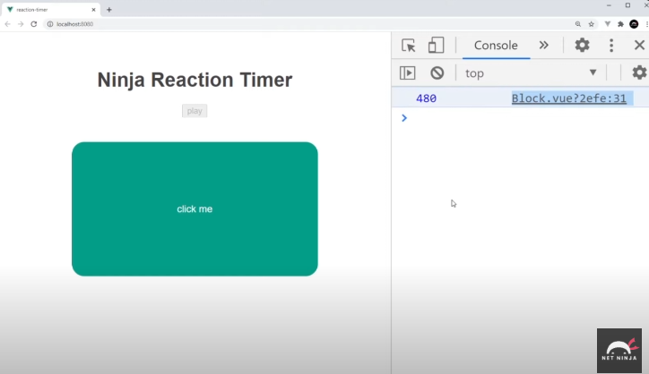

En ese proyecto vamos a construir el primer proyecto de verdad. Un Reaction Timer que mida el tiempo de reacción.

Va a contener 3 componentes. El primero es App.vue, y dentro vamos a enlazar Block.vue que es el bloque que aparece en la pantalla que hay que clickear lo más rápido que podamos, y Results.vue que muestra cuñanto tarda el usuario y la puntuación. 
Esta práctica reinforzará todo lo aprendido.

Primero creamos un nuevo proyecto.

```bash
vue create reaction-timer
```
Manualy select features, usar Babel solo.

Borramos el componente HelloWorld y sus importaciones.

Creamos los componentes en la carpeta componentes.

## Empezar el juego

Lo primero que queremos hacer es permitir al usuario clickear un botón para empezar el juego.
Queremos también comprobar si el usuario está jugando o no usando un booleano.
Crear un temporizador para que aparezca el objeto a hacer click aleatoriamente en la pantalla.

Para empezar, en App.vue, vamos a crear el botón para empezar a jugar:
Cuando el usuario haga clic en el botón, queremos disparar una función llamada start.

```html
<template>
    <h1>Reaction Timer</h1>
    <button @click="start">Play</button>
</template>
```

```html
<script>
    export default {
        name: 'App',
        components: { },
        data() {
            return {
                isPlaying: false,
                //tiempo hasta que aparezca el bloque
                delay: null
            }
        },
        methods: {
            start() {
                //Aquí dentro quiero comprobanr si está jugando, y poner un tiempo para que se muestre el bloque en pantalla.
                
                //el tiempo hasta que se muestra el bloque, 2000 milisegundos más un número aleatorio, esto ará un min de 2 segundos y un máximo de 7 segundos
                this.delay = 2000 + Math.random() * 5000
                //cuando se haga click en el botón, empieza a jugar
                this.isPlaying: true
                console.log(this.delay)
                }
        }
```

Ahora vamos a crear el bloque, en Block.vue
Creamos un div que dispare la función de parar el temporizador.
Importamos el delay como una prop.
```javascript
<template>
    <div @click="stopTimer">
        click me
    </div>
</template>

<script>
export default {
    props: ['delay']

}
</script>


<style>
.block{
    width: 400px;
    border-radius: 20px;
    background: #0faf87;
    text-align: center;
    color: white;
    padding: 100px 0;
    margin: 40px auto;
}
</style>
```

Ahora en App.vue importamos el componente Block

```js
import Block from './components/Block.vue'

    export default {
        name: 'App',
        components: { Block },
        data() {
            return {
                isPlaying: false,
                
                delay: null
            }
        },
```

Y lo usamos en la plantilla de App.vue

Y añadiremos un `v-if` para que solo aparezca cuando se está jugando sea true.
También tenemos que pasarle el delay usando un `v-bind` para pasarle la propiedad delay.

Vamos a añadir una cosa más, y eso es la propiedad de disabled, un atributo normal de vue, pero vamos a enlazar datos a la propiedad. Queremos que aparezca la propiedad cuando isPlaying sea cierto, para que no podamos darle click. Para eso ponemos `:disabled="isPlaying"`
```html
<template>
    <h1>Reaction Timer</h1>
    <button @click="start" :disabled="isPlaying">Play</button>
    <Block v-if="isPlaying" :delay="delay" />
</template>
```
Ahora vamos a trabajar con el delay. Pero para eso tenemos que ver lo que son los `Lifecycle Hooks` o ciclos de vida.

Cada componente que creamos en vue pasa por un ciclo de vida en la aplicación. Es creado, montado al DOM, actualizado...
Y eventualmente cuando no lo necesitamos más es destruido. Podemos acceder a estos distintos ciclos de vida y añadirle código usando lo que se llaman lifecycle hooks.
El primero al que tenemos acceso es `beforeCreate`, y se dispara antes de que el componente sea siquiera creado.
El segundo es `created`, que se dispara cuando haya sido creado el componente pero aún no montado al DOM. Podemos acceder a los datos, pero no a la plantilla aún.
El tercero es `beforeMount` que se dispara justo antes de que sea montado al DOM el componente.Aquí podemos ya acceder a todos los datos, eventos y plantillas.
El cuarto es `mounted` que se dispara justo al montar el componente. Este es un punto usado a menudo para hacer fetch requests.
El quinto es `beforeUpdate` que es antes de que los datos cambien en el DOM.
Una vez son reenderizados en el DOM, se dispara el `updated` hook, el sexto.

Luego el componente no es utilizado en el navegador, se quita. Es aquí cuando se disparan `beforeUnmount` y `Unmounted`.


¿Cómo lo usamos?

Vamos al componente Block.
Si queremos utilizar un hook lo tenemos que colocar dentro del objeto directamente.
Por ejemplo, si queremos que se dispare el código una vez se monte en el DOM ponemos:

```js
<script>
    export default {
        props: ['delay'],
        //este es el hook
        mounted() { 
            console.log('Componente montado')
        }
    }
```
Ahora cuando le demos click a play, se montará el componente en el DOM y veremos en la consola este mensaje.


Ahora vamos a probar otros:
Vamos a crear una propieda llamada showbloico porque solo voy a mostrar el div de block cuando sea showBlock True, ya que solo queremos que se muestre cuando haya pasado un tiempo aleatorio que configuramos con el delay, haciendo true la propiedad de showBlock.
Por eso es en mounted cuando queremos que comience el temporizador de delay, y en updated, cuando haya cambiado, se mostrará el bloque.

```javascript
<template>
    <div @click="stopTimer" v-if="showBlock">
        click me
    </div>
</template>

<script>
    export default {
        props: ['delay'],
        data() {
            return {
                showBlock: false
            }
        }
        mounted() { 
            console.log('Componente montado')
            //la función cambiará después del tiempo delay aleatorio, el valor de showBlock a true, y muestra en consola el tiempo esprado
            setTimeOut(() => {
                this.showBlock = true
                console.log(this.delay)
            }, this.delay)
        },
        updated() {
            //esto se muestra una vez se haya actualizado el componente, y se muestre
            console.log('componente actualizado')
        },
        //no pasará ahora ya que en ningún punto quitamos el componente pero servirá cuando usemos router y vayamos de una página a otra
        unmounted() {

        }
    }
```

Vamos a quitar el código que no necesitamos, los console.log y dejamos solo el hook mounted.
Y ahora vamos a reaccionar al Block siendo mostrado.

## Creando un temporizador

Queremos reaccionar al tiempo en el que el usuario tarda en pulsar el bloque una vez aparece en pantalla.
Así que necesitamos medir eso. Y para ello vamos a crear un temporizador usando setInterval.
Para eso necesitamos crear dos métodos en Block.vue: uno para empezar el temporizador cuando aparece el bloque, y otro para detener el temporizador.

Cómo vamos a crear este temporizador? Pues tenemos que crear dos propiedades. Una llamada timer, y reactiontime que va a contar el tiempo hasta hacer click.

```javascript

<script>
    export default {
        props: ['delay'],
        data() {
            return {
                showBlock: false,
                //esto va a guardar un setInterval, que va a correr cada 10 milisegundos, y eso aumentará el reactionTime por 10 milisegundos.
                timer: null,
                reactionTime: 0
            }
        }
        mounted() { 
            setTimeOut(() => {
                this.showBlock = True
                //llamamos aquí al método de empezar el temporizador
                this.startTimer()
            }, this.delay)
        },
        methods:{
            //queremos usar esto justo cuando aparece el bloque, que pasa en setTimeOut
            startTimer() {
                //estamos midiendo el tiempo cada 10 milisegundos, y seguirá aumentando hasta que detengamos el temporizador
                this.timer = setInterval(() => {
                    this.reactionTime += 10
                }, 10)
            },
            //cuando paremos el temporizador queremos parar la función, dejando de aumentar el tiempo
            stopTimer() {
                clearInterval(this.timer)
                console.log(this.reactionTime)
            }
       }
    }
```
Queremos llamar a stopTimer cuando el usuario haga click en el bloque, así que colocamos un evento de click que llame a la función en el div.

```javascript
<template>
    <div @click="stopTimer" v-if="showBlock">
        click me
    </div>
</template>
```


Ahora tenemos que ver cómo vamos a ver cómo decirle al componenete padre, App.vue, que tenemos ese tiempo de reacción, y si le damos click al bloque, cómo mandar ese dato al componente padre. Ya que queremos trabajar con eso en el componente padre App.vue.

## Eventos personalizados con Datos (Custom Events with Data)

Justo cuando detenemos el temporizador, cuando damos click al block, 
queremos emitir un evento personalizado, para que podamos reaccionar 
en App.vue donde tenemos `<Block v-if="isPlaying" :delay="delay" />`.
Cuando emitirmos un evento personalizado podemos mandar también datos extra,
así que podemos mandar el `reactionTime`, y podemos acceder a este en App.vue.

Para ello vamos al método donde detenemos el temporizador:

```js
    stopTimer() {
            clearInterval(this.timer)
            //podemos llamar como queramos al emit, pero el segundo argumento es los datos que queramos mandar
            this.$emit('end', this.reactionTime)     
    }
```
Entonces en App.vue:

```html
<template>
    <h1>Reaction Timer</h1>
    <button @click="start" :disabled="isPlaying">Play</button>
    <!--Usamos el nombre emit igual a un tipo de función que queramos que corra cuando este evento ocurre
    vamos a llamar a esta función endGame-->
    <Block v-if="isPlaying" :delay="delay" @end="endGame" />
</template>
```
Ahora tenemos que crear la función endGame debajo, en métodos de App.vue.

```html
<script>
    export default {
        name: 'App',
        components: { Block },
        data() {
            return {
                isPlaying: false,
                delay: null,
                //creamos una propiedad para guardar la puntiación
                score: null
            }
        },
        methods: {
            start() {
                this.delay = 2000 + Math.random() * 5000
                this.isPlaying: true
                console.log(this.delay)
                }
        },
            //tenemos acceso al dato reactionTime dentro de la función para manejar el evento
            endGame(reactionTime) {
                //actualizamos la propiedad
                this.score = reactionTime
                //reseteamos el juego
                this.isPlaying = False
            }
        }
    }
```


Ahora podemos mostrar en el DOM el reactionTime, por ejemplo:
```html
<template>
    <h1>Reaction Timer</h1>
    <button @click="start" :disabled="isPlaying">Play</button>
    <Block v-if="isPlaying" :delay="delay" @end="endGame" />
    
    <p>Reaction Time: {{ score }} ms </p>

</template>
```

Así que estamos tomando el dato del Block component, lo estamos pasando dentro del evento personalizado,
y luego escuchamos ese evento en app y llamamos a una función: `@end="endGame"`, que toma directamente el argumento y actualiza la puntuación,
y luego sacamos esa puntuación en el dom con `{{ score }}`.

Pero no quiero mostrar la puntuación, por lo que vamos a crear una nueva propiedad llamada showResults:

#### App.vue

```html
<script>
    export default {
        name: 'App',
        components: { Block },
        data() {
            return {
                isPlaying: false,
                delay: null,
                score: null,
                //nueva propiedad
                showResults: false
            }
        },
    
```

```html
<template>
    <h1>Reaction Timer</h1>
    <button @click="start" :disabled="isPlaying">Play</button>
    <Block v-if="isPlaying" :delay="delay" @end="endGame" />
    
    <!--Solo mostrarlo cuando sea True-->
    <p v-if="showResults">Reaction Time: {{ score }} ms </p>

</template>
```

Y como queremos mostrar la puntuación solo al final del juego, añadimos esto a endGame:

```js
endGame(reactionTime) {
                this.score = reactionTime
                this.isPlaying = False
                this.showResults = True
            }
        }
```

Y también modificamos start para que deje de mostrar la puntuación cuando comenzamos un nuevo juego:

```js
 start() {
            this.delay = 2000 + Math.random() * 5000
            this.isPlaying: true
            console.log(this.delay)
            this.showResults = False
        }
```

### Mostrar el resultado en el componente Results

En App.vue:

```html
<template>
    <h1>Reaction Timer</h1>
    <button @click="start" :disabled="isPlaying">Play</button>
    <Block v-if="isPlaying" :delay="delay" @end="endGame" />

    <!--Mostramos los resultados-->
    <Results v-if="showResults" :score="score" />

</template>

<script>
    import Block from './components/Block.vue'
    import Results from './components/Results.vue'

    export default {
        name: 'App',
        //añadimos el segundo componente
        components: { Block, Results },
        data() {
            return {
                isPlaying: false,
                delay: null,
                score: null
            }
        },
        methods: {
            start() {
                this.delay = 2000 + Math.random() * 5000
                this.isPlaying: true
                console.log(this.delay)
                }
        },
           
            endGame(reactionTime) {
                this.score = reactionTime
                this.isPlaying = False
            }
        }
    }
</script>
```

<!--Results.vue-->
<template>
    <p>Reaction time -  {{ score }} ms</p>
    <p class="">
</template>

<script>
    export default {
        props: ['score']
    }
</script>

<style>
</style>

Lo último que vamos a hacer es de acuerdo a la puntuación del tiempò de reacción, darle un ranking.

<!--Results.vue-->
<template>
    <p>Reaction time -  {{ score }} ms</p>
    <p class="rank">{{ rank }}</p>
</template>

<script>
    export default {
        props: ['score'],
        data() {
            return {
                rank: null
            }
        },
        mounted() {
            if (this.score < 200) {
                this.rank = 'You are a lightning fast!'
            } else if (this.score < 400) {
                this.rank = 'You are a fast one!'
            } else {
                this.rank = 'You are slow!'
            }
        }
    }
</script>

<style>
</style>