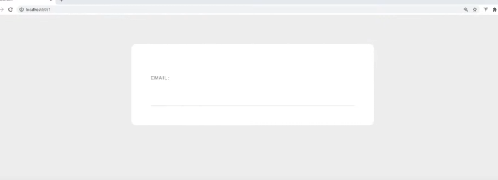
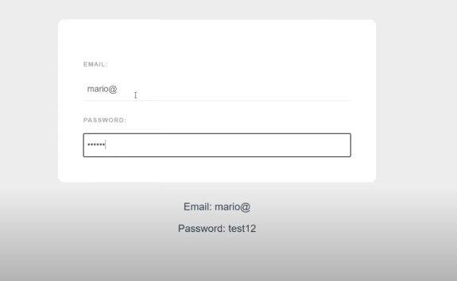
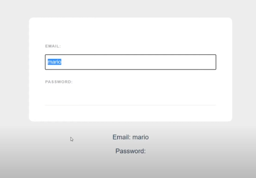
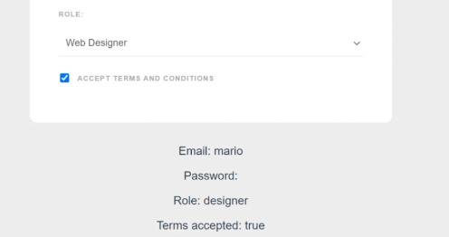
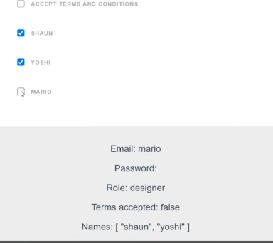
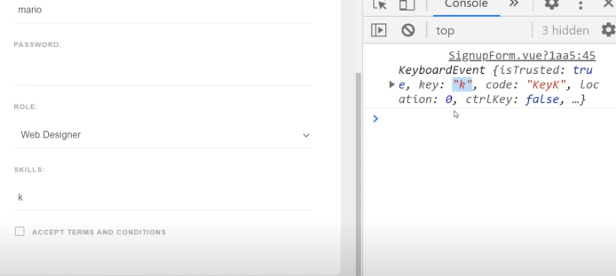
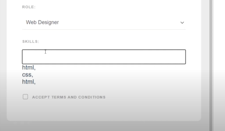
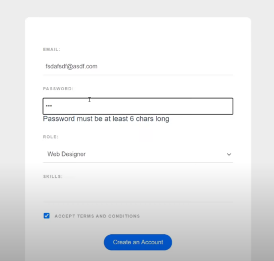

### Formularios e Inputs

Vamos a crear otro proyecto. 

```
vue create web-form
```
de nuevo seleccionamos manual, y después quitamos Linter como opción a añadir. Como las ottras veces.

Entramos a la carpeta del proyecto y lo abrimos en visual studio code.

Borramos los Hello World por defecto.

Vamos a crear un componente llamado `SignupForm.vue`, y dentro
colocamos la estructura básica de vue, que se puede poner escribiendo vue y dando click a enter.

En la plantilla haremos un formulario simple:

```html
<template>
    <form>
        <label>Email:</email>
        <input type="email" required/>
    </form>
</template>
```

Pondremos unos estilos que se pueden copiar y pegar del github ya que aquí solo quiero tomar apuntes de lo que es vue.

<a href="https://github.com/iamshaunjp/Vue-3-Firebase">Github</a>

Ahora importamos y añadimos el componente signup al componente principal, App.vue.

```js
<template>
    <SignupForm />
</template>

import SignupForm from './components/SignupForm.vue'
<script>
    export default {
        name: 'App',
        components: {
            SignupForm
            }
    }
```

Previsualizamos la aplicación en el navegador:

```bash
npm run serve
```



### 2-way data binding o enlace de datos bidireccional

Se utiliza para poder trackear de manera sencilla lo que un usuario escribe en el campo del input de un formulario o la selección que hace en un desplegable, es usar `vmodel`. Esto es otra directiva de vue, y nos permite sincronizar un campo dándonos los datos de este usando lo que se conoce como enlace de datos bidireccional.

Vamos a ver cómo funciona.

Queremos crear indormación para que podamos guardar lo que escriba el usuario en el imput del email.
Así que necesitamos nuestra función `data()` que devuelve un objeto.
Y voy a crear una propiedad llamada email, que al principio va a ser una cadena vacía. Lo que quiero es que este se actualice con lo que el usuario escriba en el input.

<!--SignupForm.vue-->

```js
<script>
    export default {
        data() {
            return {
                email: ''
            }
        }
    }
```

Así que quiero sincronizar la propiedad con el input. Y mientras se escriba en este, se va actualizando la propiedad.
Y la manera más sencilla es usar el v-model, y poner un igual con la propiedad que queremos usar para trackear ese input, que en este caso llamaremos email.

<!--SignupForm.vue-->

```html
<template>
    <form>
        <label>Email:</email>
        <input type="email" required v-model="email" />
    </form>
</template>
```

Ahora vamos a crear otro más para la contraseña.
Y además, vamos a crear un párrafo que saque esa información que estamos trackeando.

```js
<template>
    <form>
        <label>Email:</email>
        <input type="email" required v-model="email" />

        <label>Password:</email>
        <input type="password" required v-model="password" />
    </form>
    
    <p>Correo electrónico: {{ email }}</p>
    <p>Contraseña: {{ password }}</p>

</template>

<script>
    export default {
        data() {
            return {
                email: '',
                password: ''
            }
        }
    }
</script>
```



Esto significa que, cuando actualizamos el input, también se actualizarán las propiedades de los datos. Y también podemos hacerlo a la inversa. Es decir, si en la propiedad escribimos un valor, este se verá reflejado en el input.

```js
<script>
    export default {
        data() {
            return {
                email: 'mario',
                password: ''
            }
        }
    }
</script>
```

Entonces se verá esto:



### Select Boxes o cajas de selección

Podemos utilizar v-model para otros campos, no solo inputs. Uno de los campos que podemos utilizar es el select box o caja de selección.
Anadimos:
```js
<label>Role:</label>
    //le agregamos el v-model al mismo selector
    <select v-model="role">
        <option value="developer">Web Developer</option>
        <option value="designer">Web Designer</option>
    </select>
    
```

Y una nueva propiedad llamada role:
```js
<script>
    export default {
        data() {
            return {
                email: 'mario',
                password: '',
                role: ''
            }
        }
    }
</script>
```

Y en la plantilla debajo de los p'arrafos de emeail y contrasena, tambi'en se verá el select box con el valor seleccionado en la propiedad role.

```html
<p>Role: {{ role }}</p>
```


Vemos que al recargar la página, no se muestra ning'un valor. Si queremos ponerle un valor por defecto, entonces podemos escribir en la propiedad role, por ejemplo: role: 'developer', y este estar'a seleccionado por defecto.

```js
data() {
            return {
                email: 'mario',
                password: 'developer',
                role: ''
            }
        }
```

### Checkboxes

Hay dos maneras en las que podemos usar v-model con checkboxes.

Vamos a empezar creando un div con la clase terms, que ser'a el t'ipico checkbox de "Acepto los términos y condiciones".

Queremos traquear que est'e o no seleccionado , y para eso usamos el v-model en el checkbox, como antes, poniendo que es igual a alguna propiedad, que tenemos que crear en data():

```html
<div class='terms'>
    <input type="checkbox" v-model='terms' required>
    <label>Acepto los términos y condiciones</label>
</div>
```
Esta propiedad ha de ser un booleano. Y cuando est'a seleccionado es true, y cuando no, false. Por defecto, no está seleccionado, por lo que es false.
```js
data() {
            return {
                email: 'mario',
                password: 'developer',
                role: '',
                terms: false
            }
        }
```
Colocamos otro p'arrafo para ver si está seleccionado o no.

```html
<p>Terms accepted: {{ terms }}</p>
```
Ahora aparecer'a false, o true si lo seleccionamos:



La segunda manera es usando un array de valores y m'ultiples checkboxes.

Vamos a crear un div con otro input que es un checkbox.

Todas las opciones pertenecen al mismo tipo de dato, por lo que escribimos el mismo nombre de v-model de la propiedad.

Le damos un value a cada uno para que se meta en el array con ese nombre.

```html
<div>
    <input type="checkbox" value='pepe' v-model='names'>
    <label>Pepe</label>

    <input type="checkbox" value='lola' v-model='names'>
    <label>Lola</label>

    <input type="checkbox" value='marta' v-model='names'>
    <label>Marta</label>
</div>
```

Ahora creamos esa propiedad:
```js
data() {
            return {
                email: 'mario',
                password: 'developer',
                role: '',
                terms: false,
                //ser'a un array vac'io al principio
                names: []
            }
        }
```

As'i que quiero darle la opci'on al usuario de darle click a tantos checkboxes como quiera, y deseleccionar tantos como quiera. Quremos que los valores clcikeados acaben dentro del array de names.
As''i que como todos est'an asignados a la misma propiedad en los datos, no podemos poner un valor boleano de true o false. As'i que usamos un array vac'io. Este contendr'a los value de los checkbox que hayan sido seleccionados.

Vamos a colocar un p'arrafo para verlo en el dom:


```html
<p>Names: {{ names }}</p>
```



### Keyboard Events o Eventos de teclado

Ahora queremos crear un nuevo campo en el que el usuario pueda escribir las habilidades que tenga y anadirlas a un array.
Para esto necesitamos saber sobre eventos de teclado.

Para empezar, creamos un nuevo input. Y vamos a colocarle un v-model que llamaremos tempSkill, y esto se debe a que cada vez que el usuario presione cierta tecla, se agregue lo escrito a un array, y vaciaremos el input para que el usuario pueda escribir de nuevo.


```html
<label>Skills:</label>
<input type='text' v-model='tempSkill'>
```

Anadimos esta propiedad a los datos:
```js
data() {
            return {
                email: 'mario',
                password: 'developer',
                role: '',
                terms: false,
                names: [],
                //esta es la habilidad que escribimos
                tempSkill: '',
                //quiero incluir todas las habilidades en un array
                skills: []
            }
        }
```

Pero queremos que ocurra un evento de teclado, y que cada vez que el usuario escriba una coma, se tome lo escrito y se agregue a un array.
Así que queremos escuchar a que ocurra ese evento.

```html
<label>Skills:</label>
<!--Usamos keyup que se dispara cada vez que se levanta el dedo del teclado, y ejecuta una funci'on que llamaremos addSkill-->
<input type='text' v-model='tempSkill' @keyup='addSkill'>
```

Ahora tenemos que crear ese m'etodo debajo de los datos:
Queremos tambi'en tomar el objeto evento para esta funci'on que obtenemos autom'aicamente cuando una funci'on se dispara en vue.
```js
methods: {
    addSkill(e) {
        console.log(e)
    }
}

```

Ahora cada vez que presiono cualquiere tecla, se ejecuta la funci'on addSkill, y se imprime en consola el objeto evento



Así que lo que ahora queremos hacer es comprobar que se dispare cuando la tecla escrita es coma y que tambi'en haya contenido antes de esta, por lo que ponemos un condicional de que tempSkill tenga un valor.

```js
methods: {
    addSkill(e) {
        if (e.key === ',' && this.tempSkill) {
            this.skills.push(this.tempSkill);
            //limpiamos el campo del input
            this.tempSkill = '';
        }
    }
}
```

Ahora quiero recorrer las habilidade para ascarlas en el dom debajo del campo de texto, utilizando un v-for:

```html
<label>Skills:</label>
<input type='text' v-model='tempSkill' @keyup='addSkill'>
<!--e necesuta una key siempre que usamos un v-for para que vue pueda mantener trackeado cada elemento de la lista, y esta clave será única para cada habilidad, así que lo que tenemos único es la skill en sí, por lo que vamos a enlazar la skill-->
<div v-for='skill in skills' :key='skill'>
    {{skill}}
</div>
```


Funciona, pero tenemos dos problemas, y es que se incluye la coma, y que se pueden añadir valores duplicados.
Así que vamos a volver al método de addSkill y queremos asegurarnos de que la habilidad no está ya en el array.
```js
methods: {
    addSkill(e) {
        if (e.key === ',' && this.tempSkill) {
            //negamos que esté esté incluido en el array para evitar duplicados
            if (!this.skills.includes(this.tempSkill)) {
                this.skills.push(this.tempSkill);
            }
            this.tempSkill = '';
        }
    }
}
```

Para evitar que se añada la coma, añadimos el modificador `alt`, que hará que pese a que se reconozca la coma, no la muestre, porque cuando presionamos alt + coma, no se muestra la coma.

```html
<label>Skills:</label>
<input type='text' v-model='tempSkill' @keyup.alt='addSkill'>
<div v-for='skill in skills' :key='skill'>
    {{skill}}
</div>
```

### Borrar Habilidades

Queremos añadirle un evento de click a cada habilidad para que cuando se haga click en una habilidad, se borre de la lista.

Lo primero que queremos hacer es colocarle una qtiqueta para aladirle el evento de click, que dispare la función de borrar la habilidad.
Pero tenemos que pasarle la habilidad para que sepa cuál tenemos que borrar.

```html
<span @click="deleteSkill(skill)"> {{skill}} </span>
```
Ahora en métodos tenemos que crear la función, pasándole la skill:

```js
    delete(skill) {
        //usamos el método de filter para que recorra un array y si es true lo mantenemos en el array, si no, lo borramos

        //el item es el elemento que estamos iterando del array, y queremos comprobar que sea igual o no a esa skill

        //esto hace que elimine la skill que le pasamos, porque devolverá un array que se asignará a la propiedad skills que quite el item que coincida con la skill
        this.skills = this.skills.filter((item){
            return skill !== item
        })
    }

```

### Submitting Forms

Queremos simular el envío de los datos ya que hasta ahora no hemos usado bases de datos, pero podemos establecer cosas como validar el tamaño de la contraseña.

Lo primero que tenemos que hacer es crear un botón de enviar.


```html
<div class="submit">
    <button>Create an Account</button>
</div>

```

Normalmente en html cuando le damos a submit, dispararía un evento submit. El comportamiento normal en html es refrescar la página cuando esto ocurre.

Pero lo que vamos a hacer es reaccionar a este submit event y reescribir este comportamiento para hacer algo disitinto.

Lo que vamos a hacer es agregarle un evento de submit al formulario, ya que el evento que ocurre es el formulario siendo enviado.

Y para evitar que se refresque la página, usamos un modificador de evento llamado prevent.

```html
<form @submit.prevent="handleSubmit">

```

Y tenemos que crear ese método.


```js
    handleSubmit() {
        //validamos la contraseña
        //si es menor que 5 caracteres, queremos que muestre un error en la plantilla
        //usamos un operador ternaro para variar
        // este hace que, al tener una sentencia que evaluamos (this.password.length)
        //si es true, el valor después del interrogante es el de la izquierda, si no, el de la derecha
        this.passwordError = this.password.length > 5 ? 
        '' : 'Password must be at least 6 chars long'
```

```js
data() {
            return {
                email: 'mario',
                password: 'developer',
                role: '',
                terms: false,
                names: [],
                tempSkill: '',
                skills: [],
                //añadimos la propiedad passworderror
                passwordError: ''
            }
        }
```

Y ahora sacamos el error en caso de que lo haya:

```html
        <label>Password:</email>
        <input type="password" required v-model="password" />
        <div v-if="passwordError">{{ passwordError }}</div>
```



Y por último vamos a imprimir en consola todos los datos solo en caso de que no haya un error.

```js
    handleSubmit() {
        this.passwordError = this.password.length > 5 ? 
        '' : 'Password must be at least 6 chars long'

        if(!this.passwordError) {
            console.log('email: ', this.email)
            console.log('password: ', this.password)
            console.log('role. ', this.role)
            console.log('skills: ', this.skills)
            console.log('terms accepted: ', this.terms)
        }
```