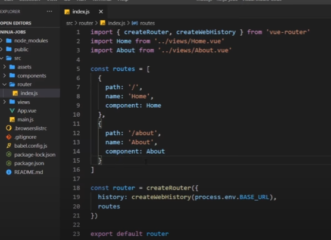
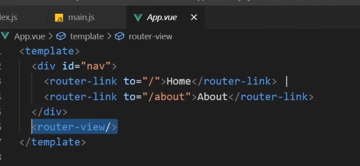

# Router

En algún punto necesitaremos utilizar más de una página. Por ejemplo, una web que tenga una página de contacto, otra de sobre mí, un blog... 

Con vue, hemos visto que hay solo un index.html que se manda al servidor. 
Y vue toma el control maneja todas las páginas del routing. No tenemos que mandar ninguna 
solicitud más al servidor.

En el caso de varias páginas, vue se fijará en la ruta en la que estamos actualmente 
en el buscador, y entonces decide qué componente meter dentro del componente de la app 
dependiendo de la ruta que sea.

Por ejemplo, si la dirección es mipag.com/contact, y tenemos ahí el componente contact.vue, entonces incluirá ese componente
en la página. Así que cuando damos click a otro link de la página, vue intercepta la solicitud
 y ve la ruta a la que hemos hecho click. Desmonta el componente actual, y monta el componente 
 que haga falta.

La manera más sencilla de empezar con esto es añadir el router al crear un proyecto.
Por ejemplo:

`vue create jobs`

Manually select features.

Elegir ROUTER, y deseleccionar Linter.
Use history for router? (Y)
Default config file.
No guardar como preset

Se creara el nuevo projecto.

`cd jobs`

`code .` par abrir en vscode

package.json
Veremos que ahora tenemos instalado vue-router en las dependencias.

En src ahora tenemos la carpeta router. Aquí está el archivo index.js que es donde configuramos
 todas las rutas.
Tenemos distintos objetos, cada uno representando una ruta distinta. 
Cada una contiene un path (url), name(nombre o identificador) y component (componente que 
queremos usar en esa ruta).

Encima del todo tenemos que importar los componentes que vayamos a utilizar.

Abajo del todo es donde se encientra una función que crea el router para la app. 
Esta es importada al principio. Esta función contiene unas propiedades; history: createWebHistory, 
usa la api de la web en el buscador, para poder seleccionar hacia atrás, hacia deñante en el 
bsucador. La segunda, es la ruta en sí misma que le pasamos, y al final, exportamos el router.

Así que cuando queramos crear una nueva ruta, tenemos que añadir un nuevo objeto al array de rutas.



En App.vue, donde pone la etiqueta router-view se renderizará el componente de la ruta.



Si colocamos algo encima o debajo, aparecerá en todas las páginas, ya que lo que cambia 
es el componente que se renderiza en router-view.

En la carpeta views se encuentran las los componentes.

### Router Links

El motivo por el que vue sabe interceptar los links hacia las otras páginas es por la etiqueta que tenemos llamada `router-link`.

```html
<router-link to="/">Home</router-link>
```

Esta tiene un atributo que dice a dónde queremos drigirnos (to="").
En caso de utilizar una etiqueta href, no funcionará porque mandaría una solicitud al servidor y este no lo localizaría.
Sin embargo al examinar la págna, veremos que se mostrará como un link a href. Y también se le asignarán unas clases automátcamente cuando está actvio (.router-link-exact-active), pudiendo añadirle estilos.

Otra ventaja es que podemos utlizar data bind a la ptopiedad `to`, y colocarle el nombre que tenemos en el objeto de rutas:

```html
<router-link :to="{ name: 'Home' }">Home</router-link>
```

La ventaja de esto es que en caso de que camben las rutas, no necesitamos actualzar los links, ya que seguirían funcionando correctamente porque están referenciados a los nombres de las rutas.

## Estructura de carpetas

Vamos a crear un nuevo componente llamado Jobs.vue en views.

```html
<template>
    <h1>Jobs</h1>
    <div v-for="job in jobs" :key="job.id">
        <h2>{{ job.title }}</h2>
    </div>
</template>

<script>
    export default {
        data() {
            return {
                jobs: [
                    { title: 'UX Designer', id: 1, details: 'lorem' },
                    { title: 'Web Developer', id: 2, details: 'lorem' },
                    { title: 'VUE Developer', id: 3, details: 'lorem' },
                    ]
                }
            }
        }
</script>
```

Ahora tenemos que añadir la ruta en `index.js`

```js
import { createRouter, createWebHistory } from 'vue-router'
import Home from '../views/Home.vue'
//importamos la vista
import Jobs from '../views/Jobs.vue'

const routes = [
    {
        path: '/',
        name: 'Home',
        component: Home,
    },
    //agregamos el objeto para esta ruta
    {
        path: '/jobs',
        name: 'Jobs',
        component: Jobs,
    }

const router = createRouter({
    history: createWebHistory(process.env.BASE_URL),
    routes
})

export default router
```

Y luego en `App.vue` vamos a colocar un link que nos dirija hacia esa ruta:

```html
<template>
    <div id="nav">
        <router-link :to="{ name: 'Jobs' }">Jobs</router-link>
    </div>
</template>
```


Vamos a suponer que queremoos que cada trabajo sea un link que nos lleve a los detalles de este. Así que necesitaríamos un componente `JobsDetails.vue`.
Para esto podemos considerar crear una subcarpeta llamada `jobs` para todo lo relacionado con jobs, ya que quedaría más ordenado.

Pero ahora habría que cambiar la importación del archivo de rutas ya que ha cambiado su luagar:

De:
```js
import Jobs from '../views/Jobs.vue'
```

A:
```js
import Jobs from '../views/jobs/Jobs.vue'
```

Además, la carpeta `components` se utilizará para componentes que se reutilicen en el proyecto, como podría ser la barra de navegación, footer, un modal, una tarjeta... Lo que no pertenezca a una página en específico
y pueda ser usado en varias vistas.

### Parámetros en la ruta

Siguiendo con el proyecto de jobs, ahora si quisiiéramos crear una ruta para los detalles de cada trabajo, lo más usual es que esta sea algo similar a su id, como por ejempplo `/jobs/123`.
Esto en vue se conoce como route parameter, que se escribe como `jobs/:id` dos puntos y el nombre del parámetro.

Entonces vamos ahora a index.js y añadir esta ruta.

```js
import JobDetails from '../views/jobs/JobDetails.vue'

const routes = [
    //las demás rutas antes
    {
        path: '/jobs/:id',
        name: 'JobDetails',
        component: JobDetails
    }
    ]
```

Ahora vamos a utilizar parámetros de la ruta para obtener elementos específicos de la ruta. Usando `$route.params.id` para acceder al parámetro de la ruta que llamamos id, pues tenemos `:id` en el archivo de rutas.


```js
<template>
    <h1>Job Detail Page</h1>
    <p>The job id is {{  $route.params.id }}</p>
</template>
```

También podemos acceder a este dato dentro del objeto del componente, la diferencia es que tenemos que usar this. al estar dentro del componente.
Y ahora en la plantilla solo tenemos que poner `{{ id }}` para que se muestre el valor de id.

```js
<template>
    <h1>Job Detail Page</h1>
    <p>The job id is {{ id }}</p>
</template>

<script>
    export default {
        data() {
            return {
                id: this.$route.params.id
            }
        }
    }
</script>
```

### Links Dinámicos

Queremos que al hacer click en cada trabajo, nos dirija hacia la url con la id de ese trabajo.

<!--Jobs.vue-->


```html
<template>
    <h1>Jobs</h1>
    <div v-for="job in jobs" :key="job.id">
        <!--Escribimos la ruta hacia Jobdetails, pero también tenemos que pasarle un parámetro id, que se hace con params: {} y un objeto de clavevalor, 
        cada clave es el nombre del parámetro, 
        y el valor en este caso es job.id ya que tenemos acceso en el bucle a este array-->
        <router-link :to="{ name: 'JobDetails'}, params: { id: job.id }">
            <h2>{{ job.title }}</h2>
        </router-link>
    </div>
</template>

<script>
    export default {
        data() {
            return {
                jobs: [
                    { title: 'UX Designer', id: 1, details: 'lorem' },
                    { title: 'Web Developer', id: 2, details: 'lorem' },
                    { title: 'VUE Developer', id: 3, details: 'lorem' },
                    ]
                }
            }
        }
</script>
```

Podemos adjuntar cualquier parámetro de la ruta a las props del componente que estamos enlazando para hacer esto un poco más sencillo. Por ejemplo, podemos aceptar el id de la ruta.

<!--JobDetails.vue-->
```js

<script>
    
    export default {
        props: ['id'],
        //data() {
        //    return {
        //        id: this.$route.params.id
        //    }
        //}
    }
</script>
```

<!--index.js-->
```js
const routes = [
    //las demás rutas antes
    {
        path: '/jobs/:id',
        name: 'JobDetails',
        component: JobDetails,
        //esta línea permite aceptar los parámetros como
        props: true
    }
    ]
```
Y así ya no tenemos que escribir `id: this.$route.params.id`, por lo que está comentado.

### Redrecciones y 404

Vamos a suponer que queremos redirigir a alguien que ponga en la url `all-jobs` a `jobs` ya que esa solía ser la url anterior, por poner un ejemplo.

Vamos a ir a `index.js` y añadimos otro objeto más:

<!--index.js-->
```js
    //redrect
    {   // desde donde redirigimos
        path: '/all-jobs',
        //a dónde queremos redirigir
        redirect: '/jobs'
    }
```

Y ya funcionaría.

Ahora queremos que nos salga un 404 si alguien pone una url que no existe. 
Por ahora, si escribimos una url que no existe, solol nos sale una página en blanco.

Así que lo primero que hacemos es crear un componente `NotFound.vue` o como queramos llamarlo.

```html
<template>
    <h2>404</h2>
    <h3>Page not found</h3>
</template>
```

Cómo hacemos que esto funcione? Pues vamos al archivo de las rutas, index.js, y añadimos un nuevo objeto

<!--index.js-->
```js
import NotFound from './views/NotFound.vue'
const routes = [
    //catchall 404
    {   //usamos algo específico que hace que incluya cualquier url que no sea las que tenemos en nuestra app
        path: '/:catchall(.*)',
        name: 'NotFound',
        component: NotFound
    }
    ]
```

### Navegación Programática

Vue utilza la api para poder ir adelante, atrás , etc. en la navegación. Vamos a aprender a manejar esto.
Vamos a añadir tres botones, y le vamos a asignar un evento a cada uno de ellos, aunque todavía no hemos creado los métodos.

<!--App.vue-->
```html
<button @click="redirect">Redirect</button>
<button @click="back">Go Back</button>
<button @click="forward">Go Forward</button>
```

Ahora vamos a crear los métodos:

<!--App.vue-->
```js
<script>
    export default {
        methods: {
            redirect() {
                //redirigimos al home, o a la página que queramos con el name que tenemos en las rutas.
                this.$router.push({name: 'Home'})
            }
            back() {
                //usamos .router cuando queremos hacer algo, no .route, que es para sacar info de la ruta
                this.$router.go(-1)
            }
            forward() {
                //usamos un número positivo para ri adelante, y negativo para ir ahcia atrás
                this.$router.go(1)
            }
            }
        }
</script>
```