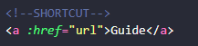
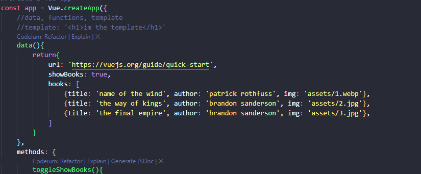
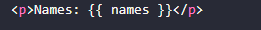

# GUÍA







## VUE WEBSITES - TUTORIAL 4
 
- Usa heramientas modernas de js
- aporta serviror live-reload
- optimiza el código para producción -> mejor performance

## Usando vue cli
- se necesita node.js instalado, este incluye npm
- npm install -g @vue/cli
- -g (instalamiento global)
- ubicarnos en la carpeta para el proyecto
`vue create nombre-proyecto`
- Pregunta cosas, le damos a manual y seleccionamos lo que queremos.
- generará el proyecto, ahora:
- `cd nombre-proyecto`
- `. code` par abrir el proyecto en vscode
Crea projectos:
node-modules, donde las dependencias están instaladas
public contiene index.html
src tiene componentes, assets, y el main.js que inicia la aplicación. importamos las cosas que necesitamos de vue allí
importamos componente app de vue file, y lo pasamos a la etiqueta div con id app
en app.vue tenemos los elementos de la app
package.json contiene scripts.
Abrimos una terminal:
- `npm run serve` inicia el servidor

Nos da un link para abrir el un navegador el proyecto.
js inyecta los componentes en el html que serán reenderzados al DOM

## VUE FILES AND TEMPLATES
Cada archivo VUE representa un componente vue.
Cada componente vue puede tener 3 partes:
1- una plantilla html
2- un script donde importamos el componente
3- un estilo css para aplicar a esa plantilla
Todo es opcional exepto la plantilla

Ahora creamos la plantilla de cada componente, dentro de cada componente.
Cuando reenderizamos el componente, cada componente será inyectado al DOM
`<template><template/>`
Dentro de estas etiquetas vue, ponemos nuestro html

Podemos utilizar data como antes:


En cuanto a los estilos para #app, son aplicados globalmente para todos los componentes, porque se añaden al div app entero. Luego veremos como scoopearlos.

en main.js es donde se reenderizan los componentes.  Entonces los componentes se añaden al html, y los estilos se poonen dentro del head.
Cuando tenemos múltiples componenetes, los añadimos a la carpeta de components.

`npm install` sirve para instalar las dependencias en node_modules de proyectos descargados de github

## TEMPLATE REFS
Nos permiten gaurdar una referencia de un elemento dom dentro de una variable. Luego cuando tengamos esa referncia podemos usar métodos y propiedades js normales en él para hacer cosas como cambair las clases, estilos etc.

Cómo se usan?

Por ejemplo vamos a añadir que al pulsar un botón, se añada la clase active, utilizando la ref:


La idea para tener una páginma legible es tener varios componentes, por ej, uno para el navbar, otro para el footer, etc. Esto hace modualr el proyecto y es reutilizable.

## Multiple components

`App.vue` es el root component, podemos llamarlo como queramos. Todos los componentes serán nested en ese componente individualmente. Dentero de esos componentes, tambn puedes tener otros componentes, como poner dentro de article.vue un content.vue y un comments.vue. A los que contienen los otros, los llamamos componentes padres, y los que tiene dentro, son componentes hijo.
Este grupo de componentes se llama árbol de componentes.


Ejemplo de componente:

Creamos una plantilla con unos estilos


En App.vue tenemos que importar el componente, añadirlo a la plantlla y listarlo en los componentes a exportar.


Pero ahora, cómo evitamos que el estilo de un componente se le añada a todo?
Podemos sobreescribir el css en ese determinado componente. Pero lo mejor es poner:
scoped


O podemos hacer el selector más específico y ya:


Lo común es utilizar un global.css en componentes para los estilos generales.


Y para usarlo tenemos que importarlo en main.js así:


## PROPS
Los props son una forma de pasar datos de un componente a otro. Y si por ejemplo varios utilizan algo como un array de datos, se puede pasar como prop a ambos componentes. Si no, tendríamos que definir los datos en cada componente.


A veces queremos pasar no solo strings como props sino un boleano o número. No puede hacerse directamente así, tenemos que hacer un data bind.

Así se ve mucho mejor:


También podemos hacer condiciones para aplicar temas segúns sea true o false.

Pasamos datos como props en componentes que lo shce mas reutilizables, más customizables y tener yuna únca fuente de verdad para los datos.

Por ejemplo, si tenemos como tema sale, entonces añade la clase sale:

customModal.vue


App.vue


## Emitting custom events

Ahora, vamos a hacer que el modal se muestre o no, añadiendo a data de App.vue, showModal = false, entonces, envolvemos el componente en un div y le ponemos v-if="showModal", así, el componente se mostrará o no según el valor de showModal.


Le ponemos un botón de evento para que ejecute una función.


Añadimos la función a los métodos y hacemos que cambie su estado al opuesto:


Ahora al darle click al botón, aparece el modal.

Ahora creamos un evento que al hacer click al div, ejecute closeModal. Para hacerlo, tenemos que hacer un método con un emit en el componente modal, y en App.vue, tenemos
a que escuchar el evento con @close="toggleModal", que será la función de cambiar el estado del modal que ejecutemos.


Ahora al darle click a cualquier lado hace que se cierre el modal.


Pero eso hace que también se cierre al hacer click dentro del modal. Por lo que usaremos Event Modifiers:

### Event Modifiers
Para reaccionar de diferentes formas a los eventos, como querer que no afecte al hijo sino restringir lo a los padres, tenemos los event modifiers.

Podemos modificar el click con click. y nos aparecerán cosas como right, left, alt, shift, que hacen que solo se actve si es el click derecho, o también se pulsa alt etc.


Y para solucionar el problema, usamos click.self solo se cerrará cuando pulsemos fuera del modal.


### SLOTS
Si queremos pasar más datos que una prop a un componente, algo más complejo.
Están los slots diseñados para pasar data a los componentes como un array, templates..
Los slots son como un contenedor que podemos pasarle datos y que se pueden reemplazar en
el componente hijo.

Por ejemplo, vamos  a sustituir las props de header y text por un slot.

Ponemos el componente con etiqueta de inicio y cerre como si fuera html, y dentro, el contenido que queramos de plantilla.


Ahora ponemos donde queramos que reenderice este contenido en App.vue con `<slot></slot>`


Y se ha modificado:


#### Nameslots
Utilizamos la etiqueta de plantilla, le ponemos el nombre que queramos con `v-slot:nombre`


y lugo en el componente, ponemos 

`<slot name="nombre"></slot>`


---repasar slots, props, event listener personalizado------


## Reto
Poner otro modal, con el mismo componente pero pasarle otra plantilla como slot.
Usar distintos métodos para toogle, como toggleModalTwo, closeModelTwo

Reutilizamos el mismo componente:
No necesitamos tocar el componente, solo el componente padre, App.vue.


## Usando Teleport

Teleportar contenido a otro lado del DOM.
Por ejemplo, queremos colocar todos los modelos dentro del div de clase modals, y no en app.

Solo tenemos que añadri otro div en el index, y en los elementos que queremos mover, cambiamos div por teleport to="#modals", que es la etiqueta id del div del index. Si es conm class, sería con un to=".modals".

Antes:

Ahora se ve:


Pero ahora, algunos estilos no están, porque estaban en #app, pero ahora basta con ponerle también #modals en los estilos.


## Life Cycles Hook
Cada componente VUE que creamos pasa por un ciclo de vida, es creado,es montado en el dom, 
es actualizado, y al final es destruido cuando no lo necesitamos.
Los life cycle hooks (o ciclos de vida) en Vue.js son funciones específicas que puedes definir en tus componentes para ejecutar código en ciertos momentos del ciclo de vida del componente. El ciclo de vida se refiere a las etapas por las que pasa un componente desde que se crea hasta que se destruye.
Por ejemplo, cuando tenemosun sertimeout para mostrar un componente.
Inicializar datos o configurar el entorno del componente:
Por ejemplo, en el hook created, el tutorial podría estar configurando variables, cargando datos desde una API, o inicializando la lógica que no requiere acceso al DOM.

Interactuar con el DOM cuando el componente está listo:
Usan mounted para ejecutar código que necesita el DOM ya renderizado, como inicializar librerías de terceros o agregar manipulaciones específicas al DOM.

Limpiar recursos o temporizadores cuando el componente se elimina:
Con el hook unmounted, puedes liberar recursos, cancelar suscripciones, o detener temporizadores para evitar fugas de memoria.

Por ejemplo, en el video podrían estar mostrando cómo cargar datos en mounted para que estén disponibles cuando el componente se visualiza, o cómo detener un temporizador en unmounted cuando el componente deja de estar en uso.
ej:
```javascript
updated() {
  console.log("El DOM ha sido actualizado.");
}
```


## Forms

### 2Way Data Binding

Para trackear lo que el usuario escribe en un input, usamos vmodel.
Por ejemplo, si tenemos un input con el vmodel "nombre", Vue.js automáticamente crea un objeto data que contiene el nombre, y podemos acceder a él en cualquier parte del componente
Esto actualizará la cadena vacía por lo que el usuario teclee en el input:


Para trackearlo tenemos que poner:


Para comprobar que lo trackeamos, probamos:


Y se mostrará debajo:


### Select Box

Creamos el elemento con etiqueta v-model:


Mostramos la selección debajo:


Incluimos el dato, y podemos darle un valor por defecto, como por ejemplo, designer.


Y funciona:


## Checkboxes

### Un único valor:

Elemento:


Ver elemento:


Dato true o false según seleccionamos, default false:


Se muestra así:


### Múltiples valores:

Usamos un array vacío para guardar los datos:





### Keyboard Events

Lanza un evento cada vez que hay un evento keyup, es decir, suelto una tecla, dentro de ese input. Entonces se activa skillup, que es una función. Dentro de eso, tomamos el objeto del evento y comprobamos la key, si hubo una coma, y si this.tempskill tiene un valor (es la variable donde guardamos lo que se escribe en el input) metido por el usuario. Si es así, entonces comprobamos que el array de skills no incluya ya el skill que se está escribiendo. Si no está, lo metemos en el array de
skills. Si está, no hacemos nada. 
Luego reseteamos el input o vaciamos para añadir otra skill.
Y usé un replace para quirar la coma.


### Hacer que al seleccionar una skill se borre:

Utilizando el método filter, que crea un array con lo que cumple la condición, si da false, lo quita.

Cambiamos el contenido del div con un span que tenga un evento de click, y llame a la función deleteSkill:


<hr>


## Submitting Forms
 y reaccionar al submit
(aún no subir a la base de datos)

Crear botón de enviar.

Añadir un evento en el formulario para evitar que se vacíen los datos por defecto.

Y lanzar una función que compruebe que la contraseña sean 6 caracteres o lanza error, y si no da error, por consola muestra los datos de los campos ingresados.


<hr>


## VUE ROUTER SETUP

- Herramienta para manejar rutas (navegación entre vistas) en aplicaciones Vue.js.
- Permite navegar sin recargar la página (SPA: Single Page Application).

Se puede instalar al crear un nuevo proyecto, seleccionando router en la selección manual.

El router crea un router.js con rutas configuradas en un array:

```js
const routes = [
  { path: '/', component: Home },
  { path: '/about', component: About }
];
```

### Router Links

Vue no interceota los enlaces normales, por lo que debemos usar el componente router-link para crear enlaces


Tiene la ventaja que se puede Data bind como:


Que funciona igual. Pero tiene la ventaja de poder actualizar rápidamente el enlace sin tener que cambiar el código de la vista. 


## Estructura de Directorios


En components: 
componentes que no sean específicos a una página y se puedan utilizar en muchas vistas, es decir, reutilizables.

En views, los componentes que son páginas, y si esa pag requiere varios componentes, crear en Views una carpeta
para esa pag de sus componentes.

En index están las rutas de la aplicación.

Crear un componente recorriendo los datos:


Index.vue


App.vue
Enlace


## Route Parameters
Detalles por ejemplo del job:


Sacar el id de la url:

JobDetails.vue


### Dynamic Links

Cuando clcikeemos a un job, nos rediriha al detalle de ese job específico.

De esta manera, le pasamos el id como clave:


Aceptar el parámetro como prop para facilitar el acceso a ese valor:
Podemos simplimicarlo así:

JobDetails.vue


Y para que funcione, en Index.js tenemos que ponerle props: true:


Y le añadimos unos estilos a los links poniendo una clase:


## Redirects y 404's

Para redirigir, por ejemplo, que una url dirija hacia cierta ruta que queremos que ya existe:

Index.js


404
Dirigir hacia una página de error NotFound.
Creamos un componente NotFound.vue en views par aredirigir allí siempre que no encontremos la ruta que queremos.

NotFound.vue


Ahora cuando queramos redirigir hacia una ruta que no existe nos dirigirá a ese componente.


### Programmatic Navigation

Podemos navegar entre rutas de manera programática, es decir, sin hacer click en un link, y podemos hacer al usuario ir hacia delante en el navegador, hacia atrás, o reditigir a la página principal:


