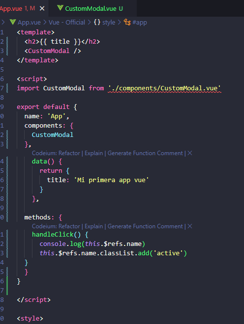
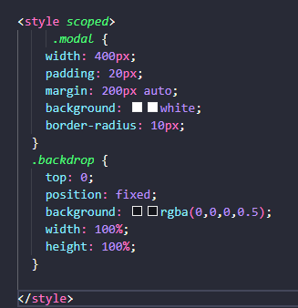
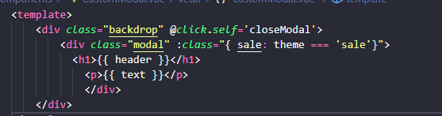
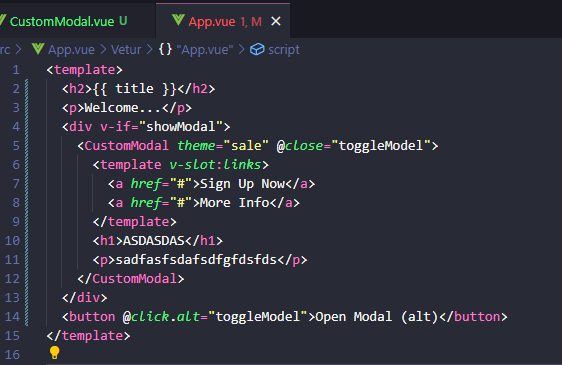

---


### Resumen del Episodio 5: **Vue.js Slots**
1. **Definición**:
   - Los *slots* son una forma de pasar contenido dinámico desde un componente padre a un componente hijo.
   - Útiles para construir componentes reutilizables y personalizables.

2. **Uso Básico**:
   - En un componente hijo, los `<slot></slot>` actúan como marcadores de posición.
   - En el componente padre, el contenido dentro del componente se renderiza en esos espacios designados.

   **Ejemplo**:
   ```vue
   <!-- Hijo.vue -->
   <template>
     <div>
       <slot></slot>
     </div>
   </template>
   ```

   ```vue
   <!-- Padre.vue -->
   <template>
     <Hijo>
       <p>Contenido dinámico</p>
     </Hijo>
   </template>
   ```

3. **Named Slots**:
   - Permiten designar varios slots dentro del componente hijo, identificándolos por nombre.
   - Uso del atributo `v-slot:nombre` en el componente padre.

   **Ejemplo**:
   ```vue
   <!-- Hijo.vue -->
   <template>
     <div>
       <slot name="header"></slot>
       <slot name="footer"></slot>
     </div>
   </template>
   ```

   ```vue
   <!-- Padre.vue -->
   <template>
     <Hijo>
       <template v-slot:header>
         <h1>Encabezado</h1>
       </template>
       <template v-slot:footer>
         <p>Pie de página</p>
       </template>
     </Hijo>
   </template>
   ```

4. **Default Slots**:
   - Si no se proporciona contenido desde el componente padre, los slots pueden tener contenido predeterminado.

   **Ejemplo**:
   ```vue
   <template>
     <slot>
       <p>Contenido predeterminado</p>
     </slot>
   </template>
   ```

5. **Uso en Componentes Dinámicos**:
   - Ideal para componentes como modales, tarjetas, o layouts que deben admitir contenido diverso.

6. **Beneficios**:
   - Facilitan la creación de UI dinámica y escalable.
   - Separan el diseño y la lógica de los datos.

### Recurso del Video:
Para más detalles y ejemplos prácticos, puedes ver el video original en [YouTube](https://www.youtube.com/watch?v=KM1U6DqZf8M).

Si necesitas expandir o estructurar más los apuntes, avísame. 😊

### **Ventajas de usar Vue CLI**
- Facilita el uso de herramientas modernas de JavaScript.
- Proporciona un servidor con **live-reload** para desarrollo.
- Optimiza el código automáticamente para producción, mejorando el rendimiento.

---

## **Usando Vue CLI**

### **Requisitos previos**
- Tener **Node.js** instalado (incluye npm).

### **Pasos para instalar y configurar Vue CLI**
1. Instalar Vue CLI globalmente:
   ```bash
   npm install -g @vue/cli
   ```
   - La bandera `-g` significa instalación global.

2. Crear un nuevo proyecto Vue:
   ```bash
   vue create nombre-proyecto
   ```
   - Selecciona la configuración manual para personalizar el proyecto.
   - Una vez generado, ingresa al directorio del proyecto:
     ```bash
     cd nombre-proyecto
     ```

3. Abrir el proyecto en VSCode:
   ```bash
   . code
   ```

### **Estructura del proyecto**
- **`node_modules`**: Contiene las dependencias instaladas.
- **`public/index.html`**: Archivo HTML principal.
- **`src/`**:
  - **`App.vue`**: Archivo raíz de la aplicación.
  - **`main.js`**: Punto de entrada donde se inicializa la aplicación Vue.
  - **`components/`**: Contiene los componentes de la aplicación.
  - **`assets/`**: Carpeta para imágenes, fuentes, etc.
- **`package.json`**: Define los scripts y las dependencias.

### **Correr la aplicación**
En la terminal:
```bash
npm run serve
```
- Esto inicia un servidor de desarrollo y genera un enlace para abrir la aplicación en el navegador.

### **¿Cómo funciona?**
- Vue inyecta dinámicamente los componentes en el DOM a través de JavaScript.

---

## **VUE FILES AND TEMPLATES**

### **Estructura de un archivo `.vue`**
Cada archivo Vue representa un componente. Sus tres partes principales son:
1. **Template (`<template>`):** Contiene el HTML.
2. **Script (`<script>`):** Lógica del componente, como datos y métodos.
3. **Styles (`<style>`):** Define los estilos CSS para el componente.

> **Nota**: Sólo la plantilla es obligatoria.

### **Funcionamiento**
- Cuando un componente se renderiza, su plantilla se inyecta en el DOM.
- Los estilos definidos globalmente afectan a toda la aplicación. Para limitar los estilos a un componente, se usa `scoped`.


### **Instalar dependencias desde un proyecto existente**
Si descargas un proyecto de GitHub:
```bash
npm install
```
Esto instala las dependencias necesarias en `node_modules`.

---

## **TEMPLATE REFS**

### **¿Qué son?**
Template refs permiten crear referencias a elementos DOM específicos, almacenándolos en variables para manipularlos mediante JavaScript.

### **Ejemplo**
Añadir una clase `active` a un elemento al hacer clic:


---

## **MULTIPLE COMPONENTS**

### **Estructura del árbol de componentes**
- **`App.vue`**: Componente raíz.
- Componentes secundarios (hijos) pueden anidarse dentro de otros componentes. Ejemplo:
  - **`Article.vue`** contiene **`Content.vue`** y **`Comments.vue`**.


### **Definir un componente**
1. Crear el archivo `.vue` con template, script y estilos.

   

2. Importarlo y registrarlo en el componente padre:

   

### **Limitar estilos con `scoped`**
Para evitar que los estilos de un componente afecten a otros:
```html
<style scoped>
/* Estilos específicos para este componente */
</style>
```



---

## **PROPS**

### **¿Qué son?**
Props permiten pasar datos de un componente padre a sus componentes hijos. Esto hace los componentes más reutilizables y centraliza los datos.

### **Cómo usar props**


Para pasar datos no string, como booleanos o números, usa *data binding*:


---

## **EMITTING CUSTOM EVENTS**

### **¿Qué son?**
Los componentes hijos pueden emitir eventos personalizados para comunicar cambios al componente padre.

### **Ejemplo:**
1. En el componente hijo:
   ```javascript
   this.$emit('close');
   ```
2. En el padre, escucha el evento:
   

---

## **EVENT MODIFIERS**

### **¿Qué son?**
Modificadores de eventos permiten gestionar mejor los eventos, como restringirlos a ciertas acciones (ej., clic derecho).

### **Ejemplo**
Para cerrar un modal sólo al hacer clic fuera:
```html
<div class="backdrop" @click.self="closeModal"></div>
```


---

## **SLOTS**

### **¿Qué son?**
Slots permiten pasar contenido dinámico (plantillas o arrays) de un componente padre al hijo.

### **Uso básico**


### **Named slots**
Definen múltiples slots con nombres específicos:


---

## **USANDO TELEPORT**

### **¿Qué es?**
Teleport mueve un componente a otra parte del DOM, ideal para modales o overlays.

### **Ejemplo**
Mover un modal a un contenedor específico:
1. Agregar un contenedor en `index.html`:
   ```html
   <div id="modals"></div>
   ```
2. Usar teleport:
   ```html
   <teleport to="#modals">
     <CustomModal />
   </teleport>
   ```

### **Antes y después**
- Antes:
  
- Después:
  

> **Nota**: Si los estilos no aplican, asegúrate de incluir el nuevo ID/clase en tu CSS.


---

